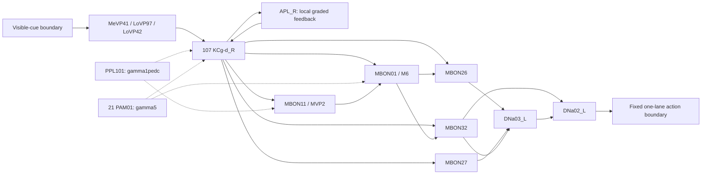

# Circuit V1: a visual mushroom-body learning route in MaleCNS

**Date:** 2026-09-29. **Status: anatomical design, exact data subset and unresolved effect policy; no electrical or physiological validation.** The reproducible data product is in [docs/CIRCUIT_V1_SUBSET.md](docs/CIRCUIT_V1_SUBSET.md); the class/effect/delay/boundary policy and its UNKNOWN coverage are in [docs/CIRCUIT_V1_EFFECT_POLICY.md](docs/CIRCUIT_V1_EFFECT_POLICY.md). The subsequent [sign/effect coverage audit](docs/CIRCUIT_V1_SIGN_AUDIT.md) partitions UNKNOWN pairs and shows that the classified-edge graph does not connect sensory input to descending output.

**2026-09-30 evidence update:** [The critical-route gate](docs/CIRCUIT_V1_CRITICAL_ROUTE_EVIDENCE.md) recommends a conditional **115-body MBON32/PPL103 alternative** for subsequent design. The 140-body source subset and effect policy described below remain the implemented, unchanged artifacts. The gate reconciles KC consensus semantics and corrects the interpretation of `receptorType`; it does not authorize electrical modelling. Sections 1–12 retain the original proposal and its provenance.

**2026-09-30 route closure:** [The three-blocker assessment](docs/CIRCUIT_V1_ROUTE_CLOSURE.md) supersedes §14's contact-localization status. It narrows plastic-contact candidacy to **796 contacts / 100 KC pairs**, brackets the motor effects as explicit hypotheses, and recommends a DN boundary proxy with an omitted-input control. Its then-open boundary blocker is addressed by §16.

**Latest, 2026-09-30 DN boundary contract:** [DN_BOUNDARY_OPERATING_STATE_CONTRACT.md](docs/DN_BOUNDARY_OPERATING_STATE_CONTRACT.md) closes the remaining boundary **design/evidence blocker through a bounded ENGINEERING ASSUMPTION**. Ready to specify Electrical Model V1; no electrical implementation, neutral dynamics pass or training has occurred. The original policy remains non-runnable.

## 1. Original decision and limits

Propose **140 traced MaleCNS v1.0 neurons**: three candidate visual inputs, the complete right-side `KCg-d` class (107 Kenyon cells), right APL, one PPL1 neuron, 21 right PAM01 neurons, five MBONs, and left DNa03/DNa02. The source contains a route from the inputs through KCs and MBONs to those descending neurons. Two KC→MBON pathways are candidates for compartment-specific plasticity.

This is the smallest proposal here that preserves a complete small visual KC class, local inhibitory feedback, separate appetitive/aversive teaching candidates, and competing output branches. **It is not a proof of the absolute minimum circuit.** Arbitrarily choosing a few KCs or deleting the inconvenient output branch would give a smaller graph without a stronger biological justification. The selection is an `ENGINEERING ASSUMPTION` constrained by anatomy and literature.

The intended first task is learning whether/when to emit one action in response to a visible cue, using a fixed descending-neuron readout. It is not yet a model of retinal vision, walking, leg motor control, or precise rhythm timing. Suitability for learning is a **testable hypothesis**, not a result: the learning-to-descending effect still depends on unknown receptor-dependent signs and substantial missing boundary drive.

**The Session 7 all-positive overlay is rejected as a biological model.** Its silent, overactive and queue-limited outcomes remain failures. No adjustment of its global gain, bias, delay or activity threshold is proposed to make it pass. This design was informed by [the scale report](docs/MALECNS_V1_SCALE_PROFILE.md), [BIOLOGY](docs/BIOLOGY.md), [ASSUMPTIONS](ASSUMPTIONS.md), [ARCHITECTURE](ARCHITECTURE.md), and [CURRENT](CURRENT.md). Its data-only selector and non-runnable evidence policy are now implemented; numerical electrical parameters, neural dynamics and training are not.

## 2. Evidence vocabulary

| Classification | Meaning in this document |
| --- | --- |
| `MEASURED` | A source observation: retained EM connection direction/contact count, or a directly observed experiment explicitly identified as such. EM counts are reconstruction-derived observations, with reconstruction/detection limitations; they are not measured conductances. |
| `LITERATURE-CONSTRAINED` | An experimental finding constrains a cell class or mechanism. Usually other animals, sometimes another sex, sensory modality or compartment; it is not physiology recorded from these exact MaleCNS bodies. |
| `INFERRED` | A homology, annotation transfer, transmitter-based expectation or circuit hypothesis without a demonstrated effect at this exact source connection. |
| `ENGINEERING ASSUMPTION` | A declared choice of model boundary, stimulus, readout, approximation or experiment design. |
| `UNKNOWN` | Not established by the imported source or the literature reviewed here. Unknown is not zero, excitatory, or permission to fit task performance. |

A source `transmitter_ground_truth` field is an annotation provenance field. It must not be relabelled as a transmitter assay in this individual. Source type names are observed annotations; their physiological interpretation is `INFERRED` unless independently constrained. Every important mechanism below has an explicit classification; anatomy and function can have different classifications on the same edge.

## 3. Source and reproducible selection

Use only the validated **MaleCNS v1.0 official traced-only** parent, with 165,122 neurons, 25,563,197 directed pairs and 124,025,046 summed contacts. Release products and their meanings are documented on the [official MaleCNS download page](https://male-cns.janelia.org/download/). Neither BANC nor hemibrain/FAFB edges are imported into this proposal.

Parent files under `data/processed/malecns_v1_traced/` and SHA-256 from the validated receipt:

| File | SHA-256 |
| --- | --- |
| `neurons.parquet` | `7d9a410d61d4caa934fa3639f9d204291ff0d18c445b2384054b95286d6350eb` |
| `connections.parquet` | `da21af867d4e8e4c627c9916e55af4332302b611a296de1d0a8bc7dd6ebcff7a` |

Selection: the 12 individually listed bodies in §4 plus all 107 rows with `cell_type == KCg-d` and `soma_side == R`, plus all 21 rows with `instance == PAM01(y5)_R`. All 140 IDs are unique and `Traced`. Complete population IDs are in §12. SHA-256 of **ascending source IDs encoded as little-endian int64 bytes**, without a header: `86d619b6562a81d7f46222c1c4aba4fffb3d1a89e44f3533e76e6646a1e2b7e9`.

Read-only queries of the parent give these `MEASURED` anatomical totals:

| Quantity | Directed pairs | Summed source contacts |
| --- | ---: | ---: |
| Complete induced graph on 140 bodies | 12,153 | 57,771 |
| Outside → selected boundary | 37,223 | 294,727 |
| Selected → outside boundary | 30,005 | 188,913 |
| KCg-d_R → KCg-d_R within the selection | 9,370 | 29,043 |
| Proposed plastic-pair candidates, before synapse-location validation | 214 | 4,146 |

The extraction retains **all** source pairs among selected IDs, including weak, recurrent and feedback connections. Tables below highlight routes, not a license to omit other edges. Anatomical counts remain immutable; electrical effects and any explicit lesions belong in separate overlays. The selected KC recurrent block has no self-pairs. Its abundance is a major physiological question, not an excuse to repeat the all-positive overlay.

All boundary counts are relative to the **traced-only parent**. Additional contacts involving untraced segments/fragments are outside this accounting; these numbers do not claim complete biological input coverage.

## 4. Concrete neuron roster

`P/C` means predicted and consensus transmitter labels agree. `GT` means the source also supplies that label in its ground-truth annotation field. No selected neuron has a non-null `receptor_type_annotation` in the imported table. That field preserves the source's sensory receptor annotation; it is not an inventory of postsynaptic neurotransmitter receptors. See the dated evidence update for its source-wide values.

| Source ID(s) / exact source instance | Role | Transmitter annotation | Functional interpretation and classification |
| --- | --- | --- | --- |
| **13285**, `MeVP41_R` | Candidate visual input | ACh, P/C; no GT | `INFERRED` visual projection identity; source superclass is `visual_projection`. Its tuning to game cues is `UNKNOWN`. |
| **13707**, `LoVP97(PLP251)_R` | Candidate visual-associated input | ACh, P/C; no GT | PLP251 cross-mapping `INFERRED`; class visual-interneuron anatomy is literature supported. `cb_intrinsic` is compatible with a local visual interneuron. Exact tuning remains `UNKNOWN`; see the critical-route report. |
| **13874**, `LoVP42_R` | Candidate visual input | ACh, P/C; no GT | `INFERRED` visual projection identity; superclass `visual_projection`. Task tuning `UNKNOWN`. |
| **107 `KCg-d_R` bodies**, §12 | Visual γ-dorsal KCs | ACh consensus; individual predictions 106 dopamine / one GABA; no GT | Visual KC function and cholinergic identity `LITERATURE-CONSTRAINED`; exact source homology `INFERRED`. Consensus can override the classifier using cell-type evidence; the earlier P/C entry was incorrect. |
| **10540**, `APL_R` | Local inhibitory feedback | GABA, P/C + GT | Local graded, non-spiking inhibitory feedback `LITERATURE-CONSTRAINED`; its spatial model and exact parameters remain open. |
| **11327**, `PPL101(y1ped)_R` | γ1pedc teaching candidate | Dopamine, P/C + GT | Homology to aversive PPL1-γ1pedc `INFERRED`; class reinforcement/plasticity role `LITERATURE-CONSTRAINED`. |
| **21 `PAM01(y5)_R` bodies**, §12 | γ5 teaching candidate cohort | Dopamine, P/C + GT | γ5 reinforcement role `LITERATURE-CONSTRAINED`; each body's reward/revaluation subtype and natural response `UNKNOWN`. |
| **11402**, `MBON11(y1pedc>a/B)_R` | γ1pedc learning output, MVP2 | GABA, P/C + GT | KC input plasticity and feedforward inhibition of M4/6 `LITERATURE-CONSTRAINED`. |
| **10013**, `MBON01(y5B'2a)_R` | γ5/β′2a learning output, M6 | Glutamate, P/C + GT | Learning-related response depression `LITERATURE-CONSTRAINED`; sign onto chosen downstream targets **`UNKNOWN`**. |
| **11176**, `MBON26(b'2d)_R` | Output relay candidate | ACh, P/C; no GT | Excitatory output is `INFERRED`; exact receptors/effect `UNKNOWN`. |
| **515034**, `MBON27(y5d)_R` | Strong visual KC output to DN route | ACh, P/C; no GT | Visual-output class and descending connectivity `LITERATURE-CONSTRAINED`; positive functional effect `INFERRED`. |
| **519131**, `MBON32(y2)_R` | Competing output branch | GABA, P/C; no GT | Inhibitory output is `INFERRED`; exact receptors/effect `UNKNOWN`. |
| **519624**, `DNa03_L` | Descending relay | ACh, P/C; no GT | Excitatory effect onto DNa02 `INFERRED`, with source connection `MEASURED`. |
| **523769**, `DNa02_L` | Fixed artificial action readout | ACh, P/C + GT | Steering-related class physiology `LITERATURE-CONSTRAINED`; key-press interpretation `ENGINEERING ASSUMPTION`. |

The three input bodies are candidates selected from strong directly connected visual-labelled inputs, not a complete visual front end. Together they supply 76 pairs / 1,427 contacts onto **59 of 107 KCs**. The other KCs are not directly driven by this input trio. Coverage is `MEASURED`; whether this produces an adequate sparse code is `UNKNOWN`.

Visual γd KC responses and involvement in visual memory have experimental support; visual projection pathways to the accessory calyx also exist. This motivates the class choice, but **does not establish MeVP41, LoVP42 or LoVP97 as the VPN-MB1/2 cells studied experimentally**. That crosswalk remains `UNKNOWN`. See [Vogt et al., Direct neural pathways convey distinct visual information to Drosophila mushroom bodies](https://elifesciences.org/articles/14009).

The atypical MBON26/27/31/32 routes to descending circuitry are described in [Li et al., The connectome of the adult Drosophila mushroom body provides insights into function](https://elifesciences.org/articles/62576). Here, MaleCNS itself determines which bodies and directions are retained. The right MB population has measured paths to **left** DNs; soma side is not treated as an axonal-output hemisphere rule. MBON31 and the opposite-side network are outside V1, with their lost input counted at the boundary.

## 5. Anatomical route and source contacts

Arrows in this diagram indicate **anatomical direction**, not excitatory sign. Dotted DAN arrows indicate proposed modulatory roles, not ordinary positive postsynaptic current.



The diagram omits numerous retained cross/feedback edges for readability. The following counts are `MEASURED` in the selected parent graph, not estimated physiological weights:

| Directed block | Pairs | Contacts |
| --- | ---: | ---: |
| Three inputs → KCs | 76 | 1,427 |
| KCs → APL / APL → KCs | 106 / 106 | 5,521 / 5,455 |
| KCs → MBON11 / MBON01 | 107 / 107 | 2,086 / 2,060 |
| KCs → MBON26 / MBON27 / MBON32 | 58 / 106 / 105 | 138 / 2,829 / 1,129 |
| PPL101 → KCs / MBON11 | 95 / 1 | 260 / 781 |
| PAM01 cohort → KCs / MBON01 | 755 / 21 | 1,453 / 528 |
| KCs → PPL101 / PAM01 cohort | 102 / 795 | 427 / 1,517 |
| MBON11 → MBON01 | 1 | 33 |
| MBON01 → MBON26 / MBON32 / MBON27 | 1 / 1 / 1 | 28 / 58 / 2 |
| MBON26 → DNa03_L | 1 | 47 |
| MBON27 → DNa03_L / DNa02_L | 1 / 1 | 108 / 4 |
| MBON32 → DNa03_L / DNa02_L | 1 / 1 | 38 / 55 |
| MBON32 → MBON26 / MBON27 | 1 / 1 | 153 / 35 |
| DNa03_L → DNa02_L / reverse | 1 / 1 | 255 / 4 |

For a concrete end-to-end path, these are exact **zero-based `source_row` values in the traced-only edge product**, retained in the normalized graph:

| Pre ID → post ID | Contacts | Source row |
| --- | ---: | ---: |
| 13285 → 74269 | 50 | 225735 |
| 74269 → 10013 | 16 | 1387698 |
| 10013 → 11176 | 28 | 626970 |
| 11176 → 519624 | 47 | 250935 |
| 519624 → 523769 | 255 | 4834 |
| Alternative: 74269 → 515034 → 519624 | 17 / 108 | 1240548 / 46270 |
| Inhibitory-branch candidate: 10013 → 519131 → 523769 | 58 / 55 | 170959 / 185086 |

These observations establish reachability, not net behavioral influence. In particular, 28 contacts with an unknown sign are not evidence that reward will increase the output.

## 6. Effects: what can and cannot be signed

| Mechanism | Classification | Defensible interpretation |
| --- | --- | --- |
| KC ACh → MBON excitation | `LITERATURE-CONSTRAINED` | KC cholinergic transmission and nicotinic excitation of MBONs, including M6/MVP2, have physiological support. Exact conductances in this animal are `UNKNOWN`. [Barnstedt et al., Memory-Relevant Mushroom Body Output Synapses Are Cholinergic](https://pubmed.ncbi.nlm.nih.gov/26948892/). |
| APL → KC inhibition | `LITERATURE-CONSTRAINED` | Local GABAergic inhibition of KC dendrites/axons; not one global spiking inhibitory pool. [Amin et al., Localized inhibition in the Drosophila mushroom body](https://elifesciences.org/articles/56954). |
| MBON11/MVP2 → MBON01/M6 inhibition | `LITERATURE-CONSTRAINED` | Feedforward GABAergic inhibition of M4/6 is experimentally supported; exact MaleCNS edge strength is `UNKNOWN`. [Perisse et al., Aversive Learning and Appetitive Motivation Toggle Feed-Forward Inhibition](https://pmc.ncbi.nlm.nih.gov/articles/PMC4893166/). |
| Candidate visual inputs → KCs; KC → APL | `INFERRED` | ACh makes excitation a plausible prior, not a verified sign for every body pair. |
| MBON26/27 → DNs; DNa03 → DNa02 | `INFERRED` | Expected cholinergic excitation; exact receptor identity, efficacy and fast/metabotropic contributions `UNKNOWN`. |
| MBON32 → MBON26/27 and DNs | `INFERRED` | Expected GABAergic inhibition; receptor/chloride-dependent effect in these targets `UNKNOWN`. |
| MBON01 glutamate → MBON26/27/32, APL and DANs | `UNKNOWN` | Do not equate glutamate with excitation or avoidance. Receptor-dependent excitation, inhibition or slower modulation must be resolved separately for each target class. |
| Other APL/MBON11 GABA outputs | `INFERRED` | Inhibition is a prior, not automatically the experimentally established APL→KC or MVP2→M6 mechanism. |
| KC → KC recurrent transmission | `UNKNOWN` | Source contacts and cholinergic identity do not establish per-contact gain, subcellular action or net recurrent dynamics. No universal positive-current assignment. |
| Dopamine → learning compartment | `LITERATURE-CONSTRAINED` | Neuromodulation/plasticity, not a substitute excitatory spike. Receptor pathways, spatial release and state dependence matter. |
| Immediate DAN effects on KCs, APL, MBONs or other DANs | `UNKNOWN` | Distinct from the plasticity rule; must not be silently modelled as positive fast transmission or silently omitted as if absent. |
| Synapse-count → conductance/weight transform | `ENGINEERING ASSUMPTION` | No calibrated universal transform is supplied. Contact multiplicity remains anatomy, not mV. |
| All remaining induced edges | `UNKNOWN` unless individually justified | Preserve anatomical existence. An explicit functional mapping or unresolved-effect record is required before simulation. |

### Competing learning-to-action hypotheses

Reward-related depression of KC→MBON01 would reduce cue drive to MBON01. For this to increase the proposed press readout, at least one route must have the appropriate effect:

1. **Disinhibition hypothesis (`INFERRED`):** if MBON01 inhibits MBON26, less MBON01 drive releases the MBON26→DNa03→DNa02 pathway.
2. **Reduced inhibitory-branch drive (`INFERRED`):** if MBON01 excites MBON32, less MBON01 drive reduces inhibition of DNa02 and the other output MBONs.

Under those same assumptions, aversive depression of KC→MBON11 can release MBON01 from feedforward inhibition and push action in the opposite direction. If the glutamatergic signs differ, or the branches cancel, these predictions need not hold. **Neither hypothesis is selected by which one wins the task.** Net effect, gain and latency require receptor/physiology evidence or must remain explicitly bracketed alternatives. The direct KC→MBON27 route could also dominate and make either learned branch behaviorally ineffective.

## 7. Plasticity proposal and its evidence boundary

Only these pair sets are proposed for a future plasticity mask:

| Candidate edges | Proposed teaching association | Evidence and limits |
| --- | --- | --- |
| 107 `KCg-d_R` → **11402 MBON11** pairs; 2,086 contacts | **11327 PPL101**, γ1pedc; appropriately ordered active cue plus aversive teaching can depress KC input | `LITERATURE-CONSTRAINED` at the compartment/class level by [Hige et al., Heterosynaptic plasticity underlies aversive olfactory learning](https://pmc.ncbi.nlm.nih.gov/articles/PMC4674068/). Transfer from olfactory experiments to these visual KCs is `INFERRED`. |
| 107 `KCg-d_R` → **10013 MBON01** pairs; 2,060 contacts | γ5 **PAM01 cohort**, candidate appetitive teaching; cue-related KC→M6 depression | Learning-related depression in M4/6 is `LITERATURE-CONSTRAINED` by [Owald et al., Activity of Defined Mushroom Body Output Neurons Underlies Learned Olfactory Behavior](https://pmc.ncbi.nlm.nih.gov/articles/PMC4416108/). γ5-associated M6 depression is also implicated in [Felsenberg et al., Integration of Parallel Opposing Memories Underlies Memory Extinction](https://pmc.ncbi.nlm.nih.gov/articles/PMC6198041/). Transfer to the exact γd contacts and teaching subtype is `INFERRED`. |

**These are 214 candidate anatomical pairs, not 4,146 individually localized, proven plastic synapses.** The current aggregate tables lack synapse ROI coordinates. MBON01 spans γ5 and β′2a; its body label alone cannot assign every contact to γ5. PPL101 directly contacts 95 selected KCs; 20 of 21 selected PAM01 bodies contact 106 selected KCs. Direct DAN→KC contact absence does not prove absent dopamine exposure, and contact presence does not define a receptor-specific plasticity field. Synapse locations, DAN terminals and compartment overlap must be reconciled before finalizing the mask.

The whole 21-body PAM01 cohort is retained anatomically because a reward-specific subdivision is not resolved here. γ5 DANs have functionally/connectomically distinct subtypes, including recurrent/revaluation roles: [Otto et al., Input Connectivity Reveals Additional Heterogeneity of Dopaminergic Reinforcement](https://pmc.ncbi.nlm.nih.gov/articles/PMC7443709/). **All 21 receiving identical reward input would be an `ENGINEERING ASSUMPTION`, not a natural sugar-reward population.** This remains a blocker to a specifically biological appetitive teaching claim.

Proposed plasticity semantics, still unimplemented:

- **Active KC plus appropriately timed compartmental DA:** `LITERATURE-CONSTRAINED`. A presynaptic activity tag is a plausible reduced model (`INFERRED`); its equation, amplitude and decay constant are `UNKNOWN` for these exact connections.
- **A mandatory pre-before-post MBON spike pair:** `UNKNOWN` as a requirement for these biological mechanisms. Do not import the synthetic fixture's existing postsynaptic-spike-gated trace as though this were established fly physiology.
- **Forward pairing causing depression in these selected learning pathways:** class evidence above is `LITERATURE-CONSTRAINED`; a universal rule for every order/context is unsupported. Distinct dopamine receptor pathways can make temporal order change plasticity direction; the experiments in [Handler et al., Distinct dopamine receptor pathways underlie temporal sensitivity](https://pmc.ncbi.nlm.nih.gov/articles/PMC9012144/) do not supply measured γ1/γ5 parameters for this model.
- **Same scalar signed `D` causing potentiation/depression everywhere:** `ENGINEERING ASSUMPTION` of the old fixture, **not adopted** here. Reward and punishment can depress different pathways; behavioral opposition can arise downstream.
- **KC→MBON26/27/32, MBON→MBON, MBON→DN and DN→DN fixed in V1:** `ENGINEERING ASSUMPTION` limiting the first experiment to the strongest selected learning evidence. This does not claim those synapses are biologically incapable of plasticity.
- **Weight bounds, recovery, consolidation, forgetting, homeostasis and short-term plasticity:** exact forms `UNKNOWN`. Any later choices require separate labels and physiology-based justification, not task-driven optimization.

## 8. Intrinsic dynamics and timing

The current source tables provide **no measured membrane constants, resting voltages, firing thresholds, adaptation parameters, receptor kinetics or conduction delays for these bodies**. The uniform M1 LIF model is not automatically compatible with every selected class.

| Population/mechanism | What constrains it | What remains unknown; modelling consequence |
| --- | --- | --- |
| Three visual input cells | Source contacts `MEASURED`; visual role partly `INFERRED` | Intrinsic dynamics, contrast/color/position tuning, latency and state dependence `UNKNOWN`. A driven point-neuron surrogate would be `ENGINEERING ASSUMPTION`. |
| γd KCs | Visual responses and sparse population coding role `LITERATURE-CONSTRAINED` | Exact excitability, adaptation, recruitment, recurrent efficacy and noise `UNKNOWN`. Do not impose sparse firing by deleting recurrence or tuning a global bias to pass. |
| APL | Non-spiking, spatially local graded inhibition `LITERATURE-CONSTRAINED` | Spatial coupling, branch time constants and release nonlinearities `UNKNOWN`. A future local graded/multicompartment approximation must be explicit; the existing all-spiking model is insufficient for this role. |
| MBON11/01/26/27/32 | Cell-class anatomy and some response/plasticity physiology `LITERATURE-CONSTRAINED` | Per-body F–I curves, resting activity, adaptation, compartment integration and synaptic kinetics `UNKNOWN`. Identical LIF parameters across all five types are not justified. |
| PPL101/PAM01 | Reinforcement and context-dependent activity at class/subtype level `LITERATURE-CONSTRAINED` | Exact tonic/phasic rates, release, receptor occupancy, reuptake and eligibility interaction `UNKNOWN`. Separate electrical state from dopamine concentration/effect. |
| DNa03/DNa02 | Descending steering circuitry `LITERATURE-CONSTRAINED` | Exact response of these source bodies to the selected MBONs and to absent background drive `UNKNOWN`; no validated keyboard command. See [Transforming a head direction signal into a goal-oriented steering command](https://www.nature.com/articles/s41586-024-07039-2). |
| Fast synaptic arrival and conduction delays | Directed anatomy `MEASURED` | Per-edge delays `UNKNOWN`; flat counts lack path lengths and velocities. The Session 7 **2 ms** delay is not evidence. Morphology-derived delay would still require inferred conduction parameters. |
| Dopamine arrival and eligibility duration | Temporal specificity `LITERATURE-CONSTRAINED` | Numerical kernels for these classes `UNKNOWN`; do not equate the game judgement timestamp with dopamine arrival. |
| Sensor/display, motor/readout and reward-feedback latency | Task interfaces | All `ENGINEERING ASSUMPTION`; separately timestamp and declare them. No values are selected in this design. |

Co-transmission, metabotropic effects, electrical coupling, metabolic state and neuromodulators outside the selected DANs are not established by a single transmitter column. Their absence from an implementation would be an explicit simplification, not a measured biological absence. APL local inhibition and unresolved recurrent KC transmission are particularly material to the previous activity failure.

## 9. Boundary inputs: this is an open circuit

These totals include **all incoming source contacts** to each group in the traced-only parent. Retained incoming contacts are those from any of the 140 selected bodies, not just the diagrammed route.

| Target group | All incoming contacts | Retained incoming contacts | Retained share |
| --- | ---: | ---: | ---: |
| Three input cells | 7,341 | 5 | 0.07% |
| 107 KCs | 60,502 | 37,699 | 62.31% |
| APL | 119,936 | 6,495 | 5.42% |
| PPL101 | 18,029 | 533 | 2.96% |
| PAM01 cohort | 20,471 | 1,741 | 8.50% |
| MBON11 | 27,730 | 3,130 | 11.29% |
| MBON01 | 24,389 | 3,062 | 12.55% |
| MBON26 | 9,931 | 343 | 3.45% |
| MBON27 | 6,022 | 3,026 | 50.25% |
| MBON32 | 16,474 | 1,226 | 7.44% |
| DNa03_L | 17,716 | 197 | 1.11% |
| DNa02_L | 23,957 | 314 | 1.31% |

These are contact fractions, **not functional drive fractions**. Much of the KC retained total is recurrent KC input. APL lacks most other KC-class input; MBON01 lacks other KC classes and its broader compartmental context. DNa03 receives omitted central-complex/LAL input, including PFL2; DNa02 receives omitted ascending and central-complex/LAL input, including PFL3. Thus isolated output activity cannot be described as an intact fly baseline.

Required boundary policy for a future model:

1. **Visible-cue input (`ENGINEERING ASSUMPTION`):** use causal image-derived features, initially a small declared set such as lane occupancy/brightness in visible screen bands, applied through the three candidate input bodies. Their game-feature tuning is artificial. No target key, ideal press time, future note, judgement or hidden target crosses this boundary. Feature-to-cell mapping must be fixed before task evaluation.
2. **Missing neural drive (`UNKNOWN` biologically):** retain cut-edge inventories by source class. A state-conditioned surrogate would be an `ENGINEERING ASSUMPTION` and needs an independent physiological target; no compensating constant current chosen to obtain presses. Setting all outside inputs to zero is an explicit lesion condition, not neutral intact physiology. Do not inflate retained conductances by the reciprocal of contact coverage.
3. **APL spatial boundary (`UNKNOWN`):** resolve which KC–APL contacts occupy relevant branches; lost activity from other KC classes cannot be replaced by a global APL firing rate. Local graded state is part of the proposed model requirement.
4. **Reinforcement boundary (`ENGINEERING ASSUMPTION`):** game judgement → separately logged utility → separately logged expectation/error → declared artificial input to candidate DANs → compartmental dopamine dynamics → local plasticity. Positive/negative task outcomes are not natural sugar/shock measurements. The expectation model and error-to-DAN mapping remain unspecified; the old global EMA is not validated fly reward coding. Signed error is not negative dopamine concentration.
5. **Action boundary (`ENGINEERING ASSUMPTION`):** a fixed causal readout of DNa02_L activity emits one-lane DOWN/UP transitions. Any integration window, threshold, release rule and cooldown must be declared separately and tested for timing artifacts; none is selected here. No trained decoder or hand-added KC→action bypass. This is a steering-output proxy; VNC premotor neurons, motor neurons and muscles are outside the boundary.
6. **Missing feedback (`UNKNOWN`):** preserve source KC→DAN, MBON→DAN, APL and recurrent connections inside the selection. External-state inputs, omitted hemisphere/MB compartments, ascending feedback and proprioception are cut. Readout success cannot validate those missing biological loops.

Keeping the cohort and output branches makes the internal topology honest; it does not fix the boundary. If physiology cannot constrain these boundaries at this size, the defensible response is to enlarge the circuit or restrict the scientific claim—not fit arbitrary drive until it learns.

## 10. Why this route, and what it can test

- **Visual γd class:** avoids an engineered visual-to-olfactory reinterpretation and is smaller than selecting all KC classes. Exact input tuning and homology remain open.
- **Two well-studied learning outputs:** MBON11/MBON01 provide an experimentally motivated contrast between learning compartments and a feedforward interaction. A one-compartment punishment-only design would be smaller but would not support the same positive/negative teaching comparison.
- **MBON27:** preserves a strong source visual-output route. It also exposes a possible non-learning shortcut that controls must distinguish from learned action.
- **MBON26 and MBON32:** preserve competing downstream routes from MBON01. Removing one merely to force a favorable net sign would prejudge the mechanism.
- **DNa03/DNa02:** a short measured output path; no fabricated bridge. One side is an explicitly asymmetric experiment, not a complete steering controller.
- **APL and recurrent KCs:** retained because known feedback and source recurrence materially affect coding and stability. The smallest easy-to-simulate graph need not be the smallest biologically defensible graph.

The coherent scientific question is: **can compartment-specific changes in visual KC→MBON transmission influence a fixed, source-connected descending output in the predicted direction under independently justified dynamics and boundaries?** It does not yet test a general reinforcement-learning algorithm or imply that the fly circuitry can learn millisecond rhythm timing. Reliable task learning, if later observed, will need paired plasticity-off and shuffled-teaching controls, frozen probes and all predeclared seeds; those runs are not authorized or started here.

## 11. Unresolved items and the next decision

| Priority | Gap | Minimum evidence needed before the corresponding implementation claim |
| --- | --- | --- |
| Blocking | MBON01 target-dependent glutamate signs; MBON32 and cholinergic output effects | Receptor/cell-type evidence or direct perturbation/physiology constraining MBON01→26/32 and the selected DN branches. Keep alternatives if evidence remains absent; never resolve them by game performance. |
| Blocking | Aggregate pairs lack compartment locations | Source synapse/ROI or morphology audit for KC→MBON11/01, DAN terminal overlap and local APL branches; establish the actual plastic-contact mask. Official MaleCNS publishes separate synapse-point/partner products; those were not fetched for this design. |
| Blocking for a natural reward-population claim | PAM01 subtype/teaching heterogeneity | Map the 21 source bodies to supported γ5 subtypes, or label broad artificial cohort stimulation as such and narrow the claim. |
| Blocking for interpreted electrical activity | Intrinsic/receptor dynamics, recurrent KC effects and missing drive | Class-specific physiological constraints and an explicit boundary model, including local graded APL. No count-only weight calibration or global gain rescue. |
| Blocking for a natural visual-input claim | LoVP97 classification and input tuning/crosswalk | Morphology/annotation reconciliation and response evidence. Do not silently drop or relabel it; revise the candidate roster transparently if contradicted. |
| Open experimental design | Precise readout, causal cue features, latency, eligibility kernels and expectation model | Independently declared engineering interfaces and class-constrained plasticity before any future task run; no performance-based sign selection. |
| Open validation | Activity, causal influence and learning | Later staged frozen physiology/route checks before training, with failure criteria. No present activity or learning gate is passed. |

**Stop condition reached for this request:** the proposal names every source body, a complete measured input→KC→MBON→DN path, biologically supported learning candidates, and explicit limits on every functional claim. **Implementation readiness is not reached.** The next work, if requested, is targeted anatomical/receptor/physiology reconciliation of these named gaps, not another whole-network electrical sweep. Synthetic learning diagnosis remains paused; when resumed, first read [docs/FUTURE_DIAGNOSTICS.md](docs/FUTURE_DIAGNOSTICS.md).

## 12. Complete population IDs

These are **MaleCNS source body IDs**, not runtime indices or random seeds.

### All 107 right KCg-d bodies

```text
19102, 30397, 35180, 36723, 38657, 39316, 39771, 41134, 42370, 42969,
43867, 44485, 44948, 46196, 47354, 47847, 48147, 48438, 48533, 48632,
48641, 48978, 49052, 49345, 49709, 49710, 50582, 51679, 51998, 52594,
52751, 52907, 53217, 53505, 56284, 57302, 57413, 57460, 57498, 57545,
57550, 58501, 58524, 58782, 60344, 60708, 60829, 61056, 62076, 62274,
63543, 64302, 64310, 66973, 67355, 67853, 67984, 71486, 71688, 72230,
72512, 73227, 74094, 74269, 74542, 76023, 76076, 78768, 81056, 81177,
81656, 83584, 84011, 84628, 85349, 85851, 85923, 86183, 86909, 87387,
89327, 91244, 96304, 99391, 102283, 103663, 104513, 106301, 111744, 120949,
127046, 128925, 135421, 144220, 150014, 153545, 157325, 159580,
520204, 520206, 526900, 531428, 533220, 533345, 534786, 535720, 536363
```

### All 21 right PAM01(γ5) bodies

```text
62731, 63391, 90867, 100258, 113067, 114700, 129563, 141615, 144315,
145094, 146603, 156028, 164086, 167009, 205884, 212085, 252045,
325731, 506819, 523638, 543677
```

### The other 12 bodies

```text
10013, 10540, 11176, 11327, 11402, 13285, 13707, 13874,
515034, 519131, 519624, 523769
```

Reproduction requires the pinned parent above and these exact IDs. A future source release, changed type annotation or corrected morphology requires a new circuit revision and boundary audit; it is not an automatic replacement for V1.

## 13. Subsequent sign/effect coverage audit (2026-09-29)

The [read-only audit](docs/CIRCUIT_V1_SIGN_AUDIT.md) traced raw MaleCNS transmitter/receptor fields through the normalized parent, this 140-body subset and the effect policy. It found **no lost transmitter or receptor metadata** among selected bodies. All 140 consensus transmitter labels are populated, but all 140 receptor annotations are null. Crucially, all 107 selected KCg-d bodies have source individual predictions (106 dopamine, one GABA) that disagree with their ACh consensus; the source cell-type prediction is dopamine for all 107. The class-level KC→MBON excitatory rule has literature support, but the exact source-label conflict and its provenance require review. No rule or numerical parameter was changed.

Of 57,771 source contacts, **45,115 (78.09%)** lie on UNKNOWN-effect pairs. The anatomical route is not a classified electrical route: sensory→KC 76/1,427, learning MBON→relay 5/96, relay→DN 5/252, and DNa03→DNa02 1/255 are all UNKNOWN. Signed-only graph filtering leaves 30 selected neurons functionally isolated; including mapped modulatory arcs still leaves all three visual inputs, three relay MBONs and both DNs isolated. DAN→KC/learning-MBON modulatory arcs exist but lack receptor/release/plastic-site calibration. The next gate is target-specific critical-route evidence and compartment validation, **before** any electrical simulation.

## 14. Critical-route evidence gate (2026-09-30)

The [evidence report](docs/CIRCUIT_V1_CRITICAL_ROUTE_EVIDENCE.md) supersedes §13's unresolved annotation interpretation and next-task recommendation. KC ACh consensus follows a source policy permitting experimental class evidence to override image predictions. The source `receptorType` field is sensory annotation, not a synaptic receptor inventory. Neither finding signs the remaining UNKNOWN connections.

**Recommended design alternative:** inputs **13285/13707/13874** → complete 107 `KCg-d_R` class → **MBON32_R 519131** → **DNa03_L 519624** → **DNa02_L 523769**, retaining the direct MBON32→DNa02 pair. Include **APL_R 10540** and **PPL103_R 14182**, with a proposed γ2 teaching field on KC→MBON32. The complete union is **115 bodies, 10,009 pairs, 45,010 contacts**. IDs, source rows, full induced totals and boundary counts are audited in the linked report/JSON. No implemented selector or policy was replaced.

This proposal removes an essential unresolved MBON01 glutamate relay and narrows the DAN candidate to one class, while making the exact MBON32 plasticity hypothesis explicit. Its **105 KC→MBON32 pairs / 1,129 contacts are candidate plastic anatomy only**. Exact synaptic localization, target effects, intrinsic/delay parameters and boundary activity remain unresolved. In particular, only 0.24% of DNa03 incoming traced-parent contacts are retained, and an inhibitory MBON route needs independently justified target drive. A fixed one-key readout is an engineered interface; no fly muscle pathway is claimed.

**Electrical readiness remains NO.** The next decision is an explicit effect/dynamics/boundary model contract grounded in this evidence, not a run or parameter search. The original 140-body artifacts remain preserved and non-runnable; the failed all-positive overlay stays rejected.

## 15. Critical route closure: motor effects, plastic-contact location, DN boundary

The [route closure report](docs/CIRCUIT_V1_ROUTE_CLOSURE.md) is authoritative for these three questions. Source topology and the 115-body proposal are unchanged (`MEASURED` anatomy; `ENGINEERING ASSUMPTION` boundary selection).

- **Motor route — `INFERRED`:** retain MBON32 519131 → DNa03 519624 → DNa02 523769 plus MBON32 → DNa02. The exact contacts are **38, 255 and 55**, respectively (`MEASURED`). Activity suppression from MBON32 and promotion from DNa03 are defensible, named functional hypotheses. Exact postsynaptic effects/receptors remain `UNKNOWN`; no default sign was inserted. The report defines three individual-edge ablations and an MBON-output-disconnected control for later comparison, without assigning strengths.
- **Plastic-contact correction — `MEASURED` / `INFERRED`:** of 1,129 KC→MBON32 contacts, 808 have both endpoints in the source γ2(R) mask. Requiring a γ2 contact from PPL103 14182 onto the same KC leaves **796 contacts across 100 KCs**. This conservative screen is an `ENGINEERING ASSUMPTION`; candidacy for plasticity is `INFERRED`. Keep all 1,129 anatomical contacts, distinguish candidate and remaining contributions on shared pairs, and do not activate a plastic mask. Dopamine access at individual terminals and the exact MBON32 rule remain `UNKNOWN`. No cell substitution is required by the present anatomical evidence.
- **Single-DAN scope — `MEASURED` / `ENGINEERING ASSUMPTION`:** PPL103_L 11752 also contacts the selected right γ2 circuit. It is a comparison body, not a new circuit member. Restricting teaching to 14182 is an experimental boundary, not complete natural DAN coverage.
- **Descending boundary — `MEASURED`:** DNa03 omits **17,674/17,716 contacts (99.7629%)** and DNa02 **23,647/23,957 (98.7060%)**, from 1,420 distinct outside bodies. These are contact fractions, not lost-current estimates.
- **Policy — `ENGINEERING ASSUMPTION`:** recommend an independently specified, cue/reward-independent DN background/state proxy (C), with missing-input omission (B) and proxy-present/MBON-output-disconnected controls. No boundary expansion (A) is made. Even the hypothetical 24-cell PFL2/PFL3 addition would retain only 6.3389% / 2.7800% of DN incoming contacts.

**Three-blocker gate: NO. Remaining blocker: `UNKNOWN` DN boundary operating-state envelope.** The proxy's represented state, temporal/shared-drive structure and admissible strength envelope need an independent basis or a bounded explicit engineering declaration before a useful frozen baseline. No numerical currents are assigned here. Exact plasticity is a later learning question, not a frozen-baseline requirement. Other electrical model specifications and non-critical UNKNOWN edges are outside this audit; the implemented policy remains non-runnable.

## 16. DN boundary operating-state contract V1

The [boundary contract](docs/DN_BOUNDARY_OPERATING_STATE_CONTRACT.md) supersedes §15's unresolved boundary-design status. It retains the same 115-body proposal and all UNKNOWN source effects.

- **MEASURED:** the omitted-input audit verifies 714/17,674 and 1,136/23,647 missing pairs/contacts at DNa03/DNa02. **430** omitted presynaptic bodies contact both DNs, supplying 14,401 and 17,331 omitted contacts. Source transmitter prediction confidence is preserved; it is not confidence in target effect.
- **INFERRED:** an active-like background state and some common drive are useful hypotheses for testing disinhibition. **LITERATURE-CONSTRAINED:** DNa02 activity depends on locomotor state; exact DNa03/DNa02 missing-current statistics remain **UNKNOWN**.
- **ENGINEERING ASSUMPTION:** `dn-boundary-v1` represents net depolarizing omitted drive as `I_i/I_ref,i = s[1 + 0.20 X_common + 0.20 X_i]`, with bounded symmetric telegraph processes, 100-ms mean flip intervals and 50-ms autocorrelation time. It has tonic mean, independent private fluctuations and boundary cross-correlation 0.5, with no slow-state variation. The background cannot read cues, notes, rewards, actions or neural outputs, and cannot reset at task events.
- **ENGINEERING ASSUMPTION:** `I_ref = (V_onset − V_rest)/R_in`, using independently fixed, separately justified DN electrical-model values; it is a passive voltage-margin scale, not measured rheobase. Predeclared joint strength levels **0.50 / 1.00 / 1.50** have normalized supports **0.30–0.70 / 0.60–1.40 / 0.90–2.10**. Nominal stays 1.00; no task-based level selection or contact-fraction scaling. No physical currents are assigned yet.
- **ENGINEERING ASSUMPTION:** mandatory later controls are proxy enabled, boundary omitted, both MBON32→DN branches disconnected with matched proxy, and a nominal independent-background diagnostic preserving marginal variance. Seeds **31001–31003** and the neutral acceptance criteria are fixed in the contract. No run was launched.

**Readiness decision:** the remaining boundary evidence/design blocker is **closed under explicit engineering bounds**. Circuit V1 can proceed to **Electrical Model V1 specification**, which must still define class dynamics, APL representation, effects/UNKNOWN handling, delays, numerical methods and physical units. Runtime and dynamics readiness remain **NO**, and biological input statistics remain UNKNOWN. Passing the future neutral gate requires bounded membrane/spiking behavior and causal integrity, never a correct keypress. Failure must be reported without selecting a stronger background or retuning intrinsic values to pass.
