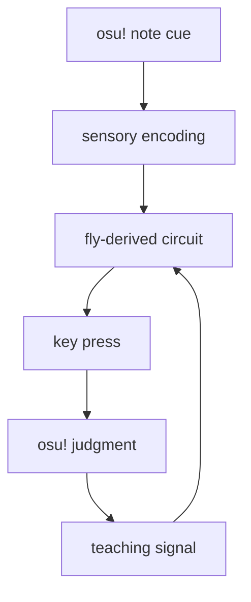

Hi there!

This is the first iteration of my Spacefly project: Attempting to make a fly brain "learn" how to play osu!mania 4k. 
(wow, the word attempting does a LOT of heavy lifting here as you will see c:)

## What does it mean for a fly to learn? 

For a first-time experienced event, some sensory input is taken in, processed by sensory neurons, which then activates a particular Kenyon-cell (KC) pattern. KCs are neurons that represent certain sensory patterns. They reside in the mushroom body, a brain region involved in learning and memory. The event at the same time (or at least close together) generates either a positive or negative outcome which activates certain dopamine neurons (DAN); PAM and PPL1 neurons specifically for reward and punishment respectively*. These signals also get sent to the mushroom body.
The cue-activated KCs and signal coincide and dopamine helps change the strength of KC-to-output neuron synapses.

In the future when the fly comes across the same sensory input, the cue activates the KCs again, and the modified connections bias output towards a positive outcome**. (e.g. go towards food if edible, stay away if not)

tldr: learning means the functional strength of synapses are being changed. 

*PAM and PPL1 clusters are way more diverse than i explain them to be, and can have way more complicated effects than just "reward and punishment".
**Of course, in a real scenario, many other factors like hunger, innate preference etc. also affect the outcome

More info: [Fly learning and the modeled mechanism](https://github.com/cknisaac/spacefly/blob/ea-mvp-engineering-assumption-fly-learner/docs/EA_MVP_FLY_TRAINING_EXPLAINER.md).

## Existing projects

With all the recent videos popping up on my feed on making flies play games, I was curious on how these projects worked. However, I realized that many projects online did not actually demonstrate the fly's capacity to learn. 

Most* projects on game demos keep the fly circuit and weights fixed (such that synapse strength doesn't and cannot change) while training an external controller to interpret neural activity as game actions: "This activity most likely implies this game action." The external component is the one learning, while the fly brain is just a computational substrate. 

*well, at least the ones i came across

## The goal of this project:

Can a MaleCNS circuit learn lane choice and precise timing in four-lane osu!mania through internal, reinforcement-driven synaptic changes?

## What even is MaleCNS?

MaleCNS v1.0 is a connectome dataset. A connectome is a map which shows the placements of neurons, where they run and their synapse connections. Specifically, MaleCNS is that of an adult male fruit fly's central nervous system, mapping the brain, optic lobes and ventral nerve cord (spinal cord basically) with connections preserved across the neck.

More info: [Connectome source data](data/README.md).

## What is osu!mania?

osu!mania is a VSRG (vertical scrolling rhythm game). Notes appear from the top (or bottom) of the screen and move up (or down) to a judgement line, where you must hit it in time to achieve an accuracy score. 

## Start

I originally intended the flow of the project to go like this:

A visual note appears on screen, a fixed, artificial sensory encoder converts the lane and current position of the note into timed input (the fly brain has no eyes). Then, we specify a circuit route: activated KCs form a cue-related activity pattern, influencing mushroom-body output neurons and descending neurons; neurons that carry signals down to local motor circuits. A fixed readout turns that descending activity into a key-down and key-up event (the fly brain has no limbs), which is then judged by the game on how accurate the key press was. 

That judgement is then turned into a utility score and compares it against its predicted utility. A artificial teaching route* maps the error (actual - predicted utility score) to vary selected dopamine neurons which sends signals to the mushroom body. The signals adjust the strength of selected connections, and eventually after lots of training, the timing of key presses would hopefully become more accurate. 

*the fly gains nothing out of getting a good score, so we recreate feedback artificially 

Given our limitations of not having a literal fly, we have multiple engineered interfaces, particularly the sensory encoder, fixed keyboard readout, utility and artificial teaching routes

More info: [Design and engineering assumptions](https://github.com/cknisaac/spacefly/blob/ea-mvp-engineering-assumption-fly-learner/docs/EA_MVP_SPEC.md).

## Problems

However, there were tons of problems at both the circuit and learning stages. 

The selected MaleCNS circuit did not reliably carry visual input all the way to the intended output.
With a 140 neuron circuit, the encoder sent signals to the KCs but all of them (107) did not spike. 
Directly simulating KCs to send signals to MBON32 (a chosen mushroom body output neuron) also did not spike it.
Directly simulating MBON32 however made descending neurons respond, but it still stands that the circuit could not fully link well.
Increasing and decreasing the neuron count in the circuit supported small parts of the circuit, but did not immediately solve the bottleneck.

This is where the difference between a connectome and a biological circuit comes in.
MaleCNS can show which neurons are connected, but not how strongly or quickly they affected each other, or what input did a neuron need to fire. So, "directly simulating" caused issues as measured values are not available for the exact circuit. I COULD tune the numbers over countless runs, but 1) that would take countless hours and 2) It won't let me learn anything about the fly's behaviour.

The synthetic learner also had issues with its policy. One notable example was how it led to very good accuracy inputs, but only if a unscored input was registered earlier for the same approaching note. Eventually after a long time repeatedly tuning with no results (coupled with issues with the actual circuit), I realized that this intended project would be going into a indefinite research loop.

So instead, I decided to first recreate the osu!mania game interface with all the useful parts (basically a clone) to ensure my validity tests were accurate and represented the actual game.

More info: [Visual-route report](docs/ELECTRICAL_V1_SENSORY_ROUTE_CAUSALITY.md), [later circuit controllability](docs/B3_CANDIDATE1_CONTROLLABILITY.md), and [synthetic learner diagnosis](docs/SYNTHETIC_M2_ROOT_CAUSE.md).

## v2

Then, the flow of the project turned into this:

The fly circuit has 32 KCs, assigned a different preferred position based off a countdown of the note till judgement line hit. Every 1ms, encoder gives the KCs near the current note position the strongest electric input and less to KCs further and further. Each KC accumulates that input, and after enough accumulation of input: above a firing threshold, send signals to MBON05. Then, a fixed rule reads MBON05, and if its voltage is within a certain set threshold, issue a DOWN key press, then an UP 10ms later. After each spike (above threshold), reset the voltage of the specific KC.

What about hold notes? Software keeps the key DOWN and releases when the visible tail (information from the game renderer) reaches the hit line.

Multiple notes (chords)? Software noted if two notes reached the line together, the one timed press would be copied to both lanes. 

For a crowded chart (higher difficulty), the software handles the closest note first, then after the cue changes, buffer 11ms for readout to finish the cue, reset and get ready for the next. If the circuit decided DOWN for a key already DOWN, the software suppressed that new input. 

During training (500 reps of one tap trial): the first few (358) runs, model made no presses so the game marked a miss. the dopamine neurons are directly stimulated, and the learning rule looked at each KC spiked within a 250ms eligibility window, then asked:

Did this KC spike in the preceding 250 ms?
Is its KC→MBON05 connection one of the 32 selected connections?
Is that KC covered by one of the active, anatomy-selected DANs?
If so, modify that connection.

You can view how training went here: 

https://github.com/user-attachments/assets/6582b5f8-d974-4e43-b521-f25ee35cc9e2

More info: [Interactive training HTML](https://github.com/cknisaac/spacefly/blob/ea-mvp-engineering-assumption-fly-learner/visualization/ea-mvp-training-playback.html), [training explainer](https://github.com/cknisaac/spacefly/blob/ea-mvp-engineering-assumption-fly-learner/docs/EA_MVP_FLY_TRAINING_EXPLAINER.md), and [assumption registry](https://github.com/cknisaac/spacefly/blob/ea-mvp-engineering-assumption-fly-learner/docs/EA_MVP_SPEC.md).

## Results 

Probably every rhythm game enthusiast has heard of Freedom Dive. So i decided to make it play one of the most popular maps and see how it went :)

You can view the results here: 

https://github.com/user-attachments/assets/240138f4-dff9-4a6c-a03b-74153c150c61

(sorry i know the video is silent just imagine the music, if you've never heard it before give it a listen online c:)

More info: [Iteration-one results](https://github.com/cknisaac/spacefly/blob/ea-mvp-engineering-assumption-fly-learner/docs/EA_MVP_ITERATION_1_SUMMARY.md) and [saved receipt bundles](https://github.com/cknisaac/spacefly/tree/ea-mvp-engineering-assumption-fly-learner/results/ea-mvp-iteration-1).

So, does this mean a real fly can learn to play osu!mania? Probably not (yet). Can we take a small part of a fly’s brain map, fill in the missing pieces with engineered rules, then train it to time key presses in a recreated osu!mania game? Sure! 

Thanks for reading so far! 
This project is far from complete. My end goal is to recreate as much of the biological learning process as possible, maybe discover a few new things along the way, and eventually test it on way harder and way more variety of maps. This is just the beginning :)

[Previous README](docs/history/README-before-iteration-1.md).
