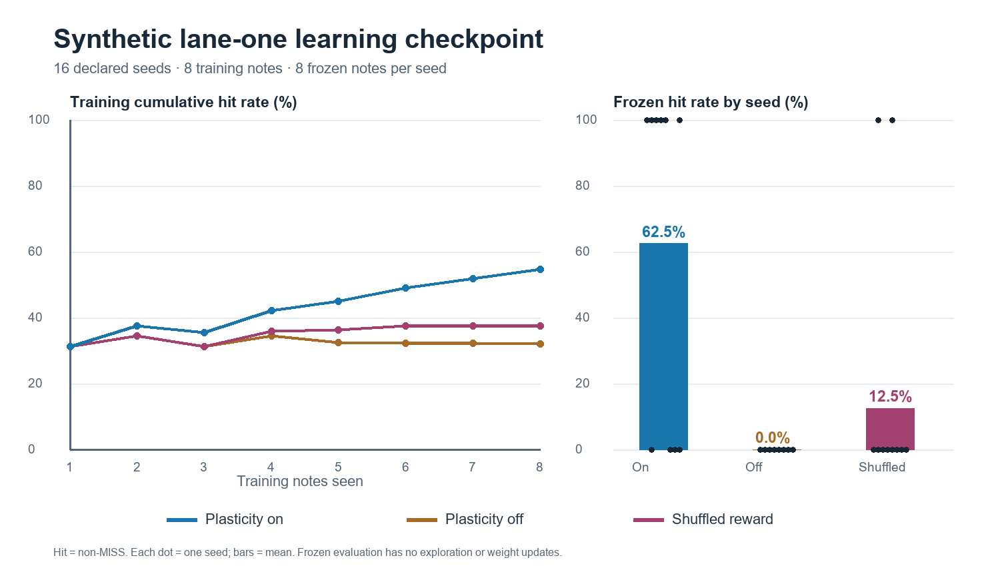

# Synthetic lane-one plasticity checkpoint

**Status: the declared reliability gate failed.** This is a test of the engineered 128-neuron fixture, not a fly-connectome result or completion of M2.

## Declared design

The exact seed list, note counts, primary metric and decision gate are in [`configs/checkpoint_controls.json`](../configs/checkpoint_controls.json), written before the sweep. Seeds 0–15 each ran the same one-lane, evenly spaced 16-note map under three conditions. The first eight notes allowed seeded motor exploration and (except in the off condition) weight updates. The last eight disabled both. No seed was excluded.

| Condition | Training feedback |
| --- | --- |
| Plasticity on | Actual game judgement → centered utility → global RPE → dopamine-like signal → selected relay-to-motor weights. |
| Plasticity off | Identical graph, map, seed and exploration stream; no weight updates. |
| Shuffled reward | For each seed, permute the plasticity-on run's eight training utilities and deliver those values in note order to a separate plasticity-enabled run. The actual game judgements remain logged. |

All 16 utility permutations changed order and retained the source utility multiset. The shuffled control is **offline yoked**: its rewards come from the reference run, not its own outcomes. The plasticity-on run is completed before constructing that control. This deliberately breaks outcome–reward pairing without altering the set of reward values. Its delivery time follows each new run's judgement, so the exact timestamps can differ. During frozen evaluation all conditions use actual utility for logging and none update weights.

The primary metric is the percentage of frozen judgements that are not MISS, computed per seed. The declared gate required the on condition to beat **each** control by at least 20 mean paired percentage points and to win strictly in at least 12 of 16 seeds. The seed is the comparison unit; repeated notes within a seed are highly correlated.

## Result

| Frozen metric | On | Off | Shuffled reward |
| --- | ---: | ---: | ---: |
| Non-MISS rate | **62.5%** | 0% | 12.5% |
| GOOD 200 or better | 12.5% | 0% | 6.25% |
| Mean hit value, of 320 | 75 | 0 | 25 |

On beat off in 10/16 seeds, tied in six, and lost in none. On beat shuffled in 9/16 seeds, tied in six, and lost in one. Mean paired advantages were 62.5 and 50 percentage points respectively. **Both comparisons fail the 12/16 seed criterion**, despite the higher means. Seed 9 is a concrete counterexample: the on condition misses every frozen note while shuffled reward scores GREAT 300 on every frozen note. The full event records, delivered utilities and comparison calculations are in [`checkpoint_controls.json`](figures/checkpoint_controls.json); [`checkpoint_controls.py`](../scripts/checkpoint_controls.py) regenerates the experiment and plot.

The left plot shows cumulative training hit rate, including exploratory pulses; it is descriptive and is **not** frozen performance at intermediate checkpoints. The right plot reports frozen performance with a dot for each seed and a bar for the mean. Results are all-or-none within a seed on this repeated, identical map.

## Timing and interpretation

All 80 non-MISS frozen judgements in the on condition are early; their mean signed error is **−85.8 ms**. The 128 frozen outcomes are 48 MISS, 16 MEH 50, 48 OK 100, 8 GOOD 200 and 8 GREAT 300; there are no MAX 320 judgements. The earlier seed-1 demonstration's repeated −76 ms OK is therefore a typical failure mode, though it is not the only outcome. Some seeds press even earlier and score early MISS. A high non-MISS rate here does not show precise timing.

The 40-cell time-to-contact input has broad overlapping tuning, and the fixed motor readout presses as soon as six motor spikes accumulate in 20 ms. That threshold can cross on the rising cue before note time. The current exploration pulses can also occur throughout the visible cue. The global reward predictor learns only one expected utility: an early OK has utility −0.375, yet can still generate **positive RPE** if it is better than the current expectation. Once an early-response policy becomes repeatable, later cue states may no longer drive the judged action. These are plausible mechanisms based on code and logged errors, not a proven causal decomposition.

## Current limits and next discriminating tests

1. **Timing:** measure sensory, relay and motor spike timing around the note, then sweep fixed readout threshold/window and sensory tuning on training maps only. Keep the motor mapping fixed and report press-error distributions, 200+/300+/320 rates and misses. A later fixed threshold by itself must also pass controls.
2. **Credit and exploration:** compare the current global RPE against an explicitly specified context-conditioned prediction. Test a separate, labelled timing-sensitive utility and a training-only exploration schedule that samples later cue phases. Preserve the original unshaped utility as a control, and do not expose future judgement or an ideal action to the network.
3. **Generalization:** predeclare a new seed set and randomized note-spacing maps with held-out frozen episodes. Re-run on/off/shuffled under identical tuning budgets, evaluate the seed as the independent unit, and include null presses and weight saturation in diagnostics.

No fix above has been implemented or claimed to work. The present graph supports a mean plasticity advantage on one simple map and simultaneously shows that reliable, precise learning remains unproven.
