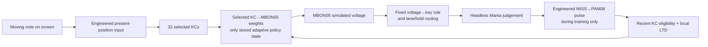

# How a hypothetical fly would train, and what EA-MVP actually does

**Scope.** This report describes the engineering-assumption EA-MVP, especially the saved seed-907 weights used for the *Freedom Dive 4K Normal* replay. It does not revise any strict-biology result. No living fly saw the game, no physical keyboard was driven, and no complete fly brain was simulated. The selected KC→MBON05 contacts and cell identities come from the pinned MaleCNS anatomy; the way osu! notes enter that circuit and its route to virtual keys are artificial interfaces.

**The central distinction:** the model **trained on 500 repetitions of one lane-0 tap with a fixed 500 ms visual approach**. It later faced lane changes, chords, holds, and the song with those synaptic weights frozen. The later patterns were tests of transfer through engineered routing, not additional training experiences.

## 1. A moving note reaches the eyes

**A hypothetical fly would train like this.** Its compound eyes would transduce light from a display. Visual processing in the optic lobe could detect motion; experimentally studied T4/T5 cells are direction selective. The animal would still have to distinguish our four game lanes, note heads, and long-note tails and make them relevant to a response. Existing visual-motion evidence does **not** establish that those symbols reach this selected mushroom-body circuit in a usable form. ([Visual-motion experiment](https://elifesciences.org/articles/29044))

**But we lack a measured osu!-screen→KC pathway. So instead we use ENGINEERING ASSUMPTION EA-01:** a fixed sensory encoder receives the currently visible note position and produces a Gaussian-patterned electrical drive to 32 selected Kenyon cells (KCs). In the training fixture, one note moves from visible start to the hit line in 500 ms. The policy gets its **current position**, not the note's target timestamp or desired key. For the later full song, an additional **ENGINEERING ASSUMPTION FD2-A8** estimates time to contact from the last 50 ms of visible positions, then keeps the countdown from moving backward while a fixed-speed note approaches. ([Training bridge](../src/project_b/ea_mvp/bridge.py), [full-chart sensory adapter](../src/project_b/ea_mvp/screen_ttc.py))

*Plain English:* the simulator hands the circuit a tidy signal saying “the note is here now.” It does not make the model recognize pixels like a fly would have to.

## 2. Sensory activity passes through the mushroom-body circuit

**A hypothetical fly would train like this.** Sensory cues would activate biological neurons, and KC activity could affect mushroom-body output neurons (MBONs) through synapses. Adult fly connectome work directly observes KC→MBON contacts and dopaminergic neurons (DANs) in mushroom-body compartments. That anatomy is evidence of wiring, not evidence that these particular cells encode rhythm-game timing. ([Adult mushroom-body connectome](https://pubmed.ncbi.nlm.nih.gov/28718765/))

**But contacts alone do not specify exact electrical effect, sign, time constants, or all missing inputs. So instead we use ENGINEERING ASSUMPTIONS EA-03, EA-04, and EA-07:** the executable model keeps the selected source IDs/contact provenance but runs a reduced 32-KC→MBON05 spiking circuit. It uses declared contact-to-effect scales, membrane/integration values, a 1 ms step, and omitted-input boundaries. It does not silently claim that those numerical choices were measured in these exact cells. ([EA-MVP specification](EA_MVP_SPEC.md), [continuous simulator interface](../src/project_b/ea_mvp/continuous_v2.py))

*Plain English:* we kept a real wiring constraint, but supplied the missing electrical settings needed to make that small circuit run.

## 3. The circuit produces a press

**A hypothetical fly would train like this.** The animal would need brain-to-body pathways that select a leg movement, move a limb onto one of four switches, hold it if needed, and release it. Descending neurons connect a fly's brain to motor regions in the ventral nerve cord, but no measured MBON05→four-key motor route is established here. ([Descending-pathway anatomy](https://elifesciences.org/articles/34272))

**But we do not have that motor route or a trainable biological key decoder. So instead we use ENGINEERING ASSUMPTION EA-02:** a fixed, untrained readout watches MBON05 voltage while a note crosses small position bins. If a bin's maximum voltage meets the frozen inverse-threshold rule, it emits a virtual key DOWN; a tap's UP follows 10 ms later. The output rule itself never learns. We additionally use **ENGINEERING ASSUMPTIONS EA-08/EA-09/EA-10** to take lane identity from the visible frame, fan one timing event to equal-time chord lanes, and release a long note when its visible tail reaches the hit line. ([Readout](../src/project_b/malecns_continuous_position_learning/online_readout.py), [lane/chord/hold boundary](EA_MVP_SPEC.md))

*Plain English:* changed fly synapses can move a voltage across a fixed “press” threshold. The software still supplies the fingers and decides *which* key they represent.

## 4. The game gives an outcome

**A hypothetical fly would train like this.** It would need to perceive a consequence of its action and give that consequence motivational meaning. Real DANs can participate in associative learning, and experiments have paired cues with DAN activation to change KC→MBON transmission. That does not tell us how a fly would perceive an osu! PERFECT or MISS, or which of these exact MaleCNS DANs should respond. ([KC→MBON plasticity experiment](https://pmc.ncbi.nlm.nih.gov/articles/PMC4674068/))

**But there is no measured game-judgement→DAN mapping. So instead we use ENGINEERING ASSUMPTION EA-05:** the headless game judges the action; only an available **MISS** label creates a fixed 20 ms artificial current pulse in three selected PAM08 DANs. PERFECT, GREAT, GOOD, OK, and MEH are silent. The teaching adapter receives the result label and availability time, not the hidden signed timing error or target key. ([Teacher adapter](../src/project_b/ea_mvp/teacher.py), [frozen teacher protocol](../configs/ea_mvp_teacher_local_protocol_v2.json))

*Plain English:* “miss” is wired to an artificial teaching signal. We are not claiming the fly would naturally treat a game miss that way.

## 5. Recent activity gets credit, and synapses change

**A hypothetical fly would train like this.** Cue-active KCs and modulatory DAN activity might cause local, compartment-specific synaptic plasticity. Experiments support related KC→MBON depression under particular conditioning protocols, but they do not supply this model's exact update equation or values for these selected contacts. ([Plasticity experiment](https://pmc.ncbi.nlm.nih.gov/articles/PMC4674068/))

**But the exact credit window and update size are unavailable. So instead we use ENGINEERING ASSUMPTION EA-06:** a KC spike in the preceding **250 ms** makes its selected KC→MBON05 connection eligible. Eligibility decays with a **1 s** time constant. If an anatomy-selected connected DAN spikes after MISS, a bounded local long-term-depression (LTD) rule weakens that eligible connection with rate **0.00005**, never below **20%** of its run-start strength. Only the predeclared KC→MBON slots may change. Neural state resets between the short training trials; the changed weights persist. ([Local rule](../src/project_b/ea_mvp/local_learning.py), [rule implementation](../src/project_b/malecns_minimal_internal_learning/ltd.py))

*Plain English:* recent participating connections receive a small “weaken” adjustment after a miss. Those strengths are the memory; there is no Adam/PPO/BPTT update or separately trained keyboard model.

## 6. What the saved training run actually did

The song's weight file is the **seed-907 learning-on arm** of the fixed-speed confirmation. Its 500 trials repeated the same lane-0 note and 500 ms approach, starting from a seeded variation of the selected contact strengths. The first **358 trials were MISS**. After their MISS-driven local updates, the first virtual press occurred on **trial 359**, at **+1 ms** relative to the hit line; trials 359–500 were **142 PERFECT** results. Seven of the 32 selected KC→MBON05 weights changed. Once the action became PERFECT, the teacher emitted no further pulse, so those weights stopped changing. This describes this one saved seed, not every run. The exact receipt is local-only at `runs/ea_mvp/confirmation_fixed_v1/seed_907_learning_on.json.gz`; the [fixed-speed protocol](../configs/ea_mvp_confirmation_fixed_v1.json) and embedded HTML playback are committed.

Matched DAN-off, plasticity-off, and untrained controls were silent in the narrower fixed-speed checks. The user-capped three-seed check passed **3/3** at the standardized speed, short of the original **6/8** formal gate. An earlier eight-seed check over unfamiliar approach speeds **failed 0/8**: learning-on reached 13/40 Good-or-better in each seed, the same as shuffled teaching. Do not merge these different questions into one PASS. ([Variable-speed confirmation result](EA_MVP_EA6_V2_CONFIRMATION_RESULT.md), [EA-MVP specification](EA_MVP_SPEC.md))

## 7. What happened after training

The **EA-13 pattern tests** reused retained weights with plasticity and teaching off: eight rapid lane-switch taps, eight notes arranged in new chord sets, and three sequential holds. For all three saved seeds, the learned-weight arms hit these fresh fixed-speed patterns; initial-weight controls stayed silent. The shuffled-teaching arms produced **exactly the same actions and results** as learning-on. Therefore changed synapses mattered relative to an untrained start, but correct feedback-to-trial pairing has **not** been shown to be the reason they acquired the response. ([EA-13 result](EA_MVP_EA13_BROAD_EVALUATION_RESULT.md))

The later **Freedom Dive FD-4** run used the retained **seed-907** weights, kept one neural simulator alive for the song, and did **no in-map learning or game-feedback teaching**. Fixed visual adapters selected the nearest current note, estimated approach, routed the timing response to lanes/chords, and released visible hold tails. The headless recreation judged all 1,310 chart objects, saving 2,618 key transitions, score **603,684**, accuracy **88.872365%**, and max combo **94**. This is a saved full-chart engineering playback, not evidence that the circuit learned that chart. In-process osu!lazer checks matched the per-object judgements across segments, while uninterrupted full-map score parity remains unverified. ([FD-4 runner](../scripts/run_ea_mvp_fd4_chart_playback_v4.py), [FD-5 parity limit](EA_MVP_FD5_LAZER_PARITY_RESULT.md))

### An important failure pattern: `11` versus `121`

The full-chart score hides a pronounced **same-lane repeat weakness**. In a descriptive tally of tap notes whose previous tap in the same lane was **250–300 ms** earlier, a direct repeat with no strictly intermediate other-lane note had **53 MISS out of 158** second notes. A return after an intervening other-lane note had **0 MISS out of 27**. The latter includes `121`-like patterns. These are chart observations, not a controlled matched-pattern experiment; chords and surrounding notes can differ. ([Reproducible tally script](../scripts/analyze_ea_mvp_fd4_lane_repeats.py); the chart/action/judgement receipt is local-only under `runs/ea_mvp/fd4_chart_playback_v4.json`.)

One concrete direct repeat is lane 1 at **16.038 s** (PERFECT), then lane 1 at **16.308 s** (MISS). The second virtual DOWN happened at **16.142 s**, **166 ms early**, and the headless game recorded it as a `null_press`. In this full-chart receipt only **one** DOWN attempt was suppressed because its key was already held. That makes an unreleased key an unlikely explanation for most repeat failures. The stronger candidate is the **ENGINEERING ASSUMPTION** at the visual cue/readout boundary: the renderer and fixed adapter select the nearest head, track one nearest head per lane, reset the 50-ms motion history when a nearer same-lane head gives way to the next one, and briefly blank/rearm the readout at a cue boundary. An alternating lane gives the returning lane's motion tracker time to follow its next head while another lane is selected. **This causal account is an inference from code and event timing; per-tick cue and voltage traces for those chart intervals were not saved, so the precise cause remains unproven.** ([Nearest-head and motion adapter](../src/project_b/ea_mvp/multicue_adapter.py), [full-chart boundary/readout logic](../scripts/run_ea_mvp_fd4_chart_playback_v4.py))

*Plain English:* the timing circuit can press again, but the software that decides when one visible note ends and the next begins sometimes sends the second **same-key** note to it in the wrong way. A note in another lane can separate those two cues. This is a limitation of the present fly-plus-engineered-interface system; it should not be attributed to fly biology.

## How to use the playback

Open the [self-contained EA-MVP training playback](../visualization/ea-mvp-training-playback.html). At **1× simulated time**, a training trial lasts 700 ms in the view: the note reaches the hit line at 500 ms; on an early MISS, the result arrives around 628 ms and the recorded DAN spikes occur at 642 ms. The blue weight line and seven bars use the **actual saved before/after weights**. The viewer can play all 500 trials, jump to trial 359, or run at 5×/20×. It then continues through the three later pattern tests, clearly marked **frozen evaluation**. You can switch the test arm to shuffled teaching or initial weights.

The note movement is reconstructed from the frozen trial protocol and the saved test note times. The actions, judgements, teaching events, credited-spike counts, and synaptic weight changes come from the saved receipts. The interface briefly highlights a 10 ms key press so it is visible on a normal display. **It is recorded playback, not a live neural simulation; the receipts do not contain full per-millisecond KC/MBON voltage traces.** Its three frozen pattern stages are the EA-13 tests, **not** the full Freedom Dive chart; that chart's direct-repeat weakness is documented above.

**Supported claim:** under disclosed engineering assumptions, local changes in selected fly-constrained synapses acquired a press on a repeated fixed-speed note, and retained weights later supported specified frozen tests and a headless song playback.

**Unsupported claims:** that a living fly can play the game; that these selected cells see notes or control four keys; that the electrical and teaching values are physiological; that correct judgement pairing caused learning; that different speeds, dense same-lane repeats, or mixed overlapping patterns are generally solved; or that the full song score is verified against the desktop osu!lazer client.
