# Roadmap: replay the fly model on Freedom Dive Normal

**Goal:** show the frozen EA-MVP fly policy progressing through the imported *Freedom Dive* 4K Normal chart in a replay view that uses the existing recreation's map and judgement code.

**Completion status (2026-10-04):** FD-4 headless full-chart replay and FD-6 saved-trace companion passed their declared technical checks; FD-5 full-map lazer score parity remains partial. The policy weights stayed frozen throughout the song. Dense same-lane repeats are a documented weakness. The architecture and predeclared gates below preserve the original plan; the [iteration-one handoff](EA_MVP_ITERATION_1_SUMMARY.md) and [training explainer](EA_MVP_FLY_TRAINING_EXPLAINER.md) describe the final boundary.

## What the chart requires

The imported chart is `FREEDOM DiVE 4K Normal`, mapped by razlteh. Its `.osu` SHA-256 is `ced99e231e7eee354feef04bbcde6889178814cb688325bccdeeeacb00dcbff9`. The chart contains 1,310 objects: 1,220 taps and 90 holds. It has 315 two-note chords (630 notes). Under a 500-ms time-to-hit cue window, more than one note head would be visible for about 219 of the chart's 261 seconds, with as many as six heads visible at once.

The present fly policies cover isolated sequential taps, equal-position chords, and isolated sequential holds. They do not encode multiple notes at different positions in one observation, combine taps/chords/holds in a single running policy, or maintain several independent held keys. Simply replaying the EA13 trace on this chart would show the wrong actions.

## Proposed architecture

```mermaid
flowchart LR
    Map[Imported .osz / selected 4K Normal] --> Parser[Existing beatmap parser and ScrollMap]
    Parser --> Obs[Current rendered note heads, lanes, positions, hold tails]
    Obs --> Enc[Candidate fixed multi-note sensory encoder\nENGINEERING ASSUMPTION]
    Enc --> Fly[Existing connectome-derived circuit\nEA13 weights frozen]
    Fly --> Readout[Fixed multi-event key readout\nENGINEERING ASSUMPTION]
    Readout --> Game[Existing ManiaGame judgement and score rules]
    Game --> Trace[Timestamped actions, results, score, neural progress]
    Trace --> View[Separate replay companion]
```

The policy may receive only the currently rendered notes' lanes and positions, plus currently visible hold tails. It must not receive note IDs, exact hit times, future chart data, judgements, score, or the evaluator's upcoming-note schedule. The game and renderer may use the full map; the fly-side input is sampled from the current frame only.

## Staged plan and gates

| Stage | Work | Freeze and PASS criteria | Stop condition |
| --- | --- | --- | --- |
| **FD-0 — pin the imported chart** | Re-open the user's `.osz`, select 4K Normal, and verify its map hash, audio path, note objects, timing points, and lane counts against the saved map audit. Record the user's fixed scroll-speed setting. | Exact map hash and 1,310 objects; 1,220 taps, 90 holds, 315 two-note chords; no object silently dropped. This is already reported PASS; rerun as a preflight only. | Stop if the archive or selected difficulty differs. Do not substitute another chart. |
| **FD-1 — map-to-frame audit** | Sample the existing recreation's `ScrollMap` at fixed 1-ms ticks. Save only the visible object tuples `(lane, normalized_position, head_or_tail)` for test review; include simultaneous-cue counts, cue duration and hold overlap. | Deterministic frame sequence; direct spot checks against the renderer; no future timing or note ID in the fly observation. Determine whether actual per-note travel resembles the frozen EA13 500-ms position trajectory. No neural run. | If map scroll changes or lead times invalidate the frozen sensory assumption, stop and present the specific assumption needed before the neural admission run. |
| **FD-2 — freeze candidate multi-note assumptions** | Propose a fixed encoder for multiple visible heads at distinct positions and a fixed readout/event policy for concurrent lanes and hold tails. FD-1 observed up to 14 visible heads and two active holds, so document how simultaneous inputs are combined, how density is bounded or capped, and how multiple key states are maintained. | Values selected by task-independent controllability and non-saturation tests, never by song score. Record every **ENGINEERING ASSUMPTION**, why it is needed, code/config hashes, and task-free checks before use. Reuse current EA13 weights unchanged. | If a biological/connectome gate fails, preserve that result, stop, and show the exact engineering-assumption proposal for user approval before continuing. |
| **FD-3 — task-free multi-cue admission** | Feed synthetic, task-free frames spanning single notes, different note positions, lane pairs, up to 14 simultaneous heads, two overlapping active holds, and visible hold tails through one continuous neural state. No game feedback or learning. | Blank input stays silent; a single note reproduces the EA13 timing response; each multi-cue class is deterministic; no unintended lane press; KC/MBON responses remain bounded and non-saturated; weights are unchanged. | Any failed control, loss of cue identity, unexplained interference, or need for a new unapproved assumption stops map work. Version each repair; do not tune against map score. |
| **FD-4 — headless chart playback** | Convert current frames into fixed key events; run all 1,310 chart objects through the existing `ManiaGame` in one continuous policy episode. Compare frozen EA13 weights with matched initial-weight and shuffled-teaching weights from the same saved seeds. No training or in-map plasticity. | Exact action/result replay; every down/up has a lane and timestamp; no stuck key; all chart objects receive a final judgement; weights remain unchanged. Report PERFECT/GREAT/GOOD/MISS counts, hold-head/tail results, combo breaks, and extra/missing actions by pattern density. | Preserve any failure. Do not retune the encoder/readout or retrain on Freedom Dive. Any new assumption returns to FD-2 for freeze and, if outside existing approval, user approval. |
| **FD-5 — pinned lazer parity (PARTIAL)** | Sent the saved trace and exact chart through the pinned in-process ReplayPlayer in 17 segments. Inputs and 1,400 tap/head/tail outcomes match; full-map score parity remains unverified because the host times out on the uninterrupted map and some segment score callbacks vary in order. | Exact key transitions, object identity, result label, and non-miss offsets passed. Per-segment ScoreV2 totals were not repeatable in five segments. This is test-host evidence, not desktop-client input. | Preserve the score limitation; do not tune the fly model against it. Continue the separate replay viewer using the recreation trace, without claiming full-map lazer score parity. |
| **FD-6 — replay companion (PASS)** | Added a separate Pygame viewer that reuses the unchanged map parser, ScrollMap, renderer, audio asset, and ManiaGame. It shows the saved fly trace, current action count, judgements, combo, and results, with pause/restart/seek. | Headless trace validation matched all 2,618 transitions, 1,580 recreation result rows, and FD-4 final score/accuracy/max combo. Dummy display/audio renderer smoke passed. Clearly labeled as saved simulation, not live neural activity. | Physical display/audio review remains user-facing. Do not change the saved recreation app or claim installed-lazer parity. |

## Predeclared interpretation

- **Technical integration PASS:** the exact imported chart is shown in the companion, the frozen policy trace drives the recreation's headless game rules, the full chart receives judgements, and replay is deterministic with unchanged weights.
- **Playback-quality report:** report all object judgements, hold tails, action errors, combo breaks, and false presses. Keep performance descriptive until the user freezes a map-specific numerical threshold before FD-4.
- **Learning claim:** not established by a high chart score alone. EA13's shuffled-teaching weights matched learning-on exactly; the same warning applies here. If shuffled teaching matches the map replay, say that correct feedback pairing remains unsupported as the cause.
- **Biological claim:** none. Lane identity, the multi-note visual encoder, the multi-event readout, and hold-state management remain engineering assumptions unless source evidence and functional validation establish otherwise. This work does not change strict biology results.

## Current gate — FD-6 PASS; FD-5 score parity remains limited

FD-2 fixed-speed one-note admission passed under FD2-A8. FD-3 task-free multi-cue admission passed under v2. FD-4 full-chart playback passed under v4. FD-5 verified the exact frozen action trace and all 1,400 tap/head/tail outcomes against pinned in-process lazer across 17 safe chart segments; non-miss offsets matched and normalized event/action output repeated exactly. FD-5 remains PARTIAL because the test host times out on the uninterrupted 261-second chart and five of 17 segmented ScoreV2 totals varied with same-time callback order; one segment's maximum combo also varied by one. Do not claim full-map lazer score/accuracy/combo parity. Details: `docs/EA_MVP_FD5_LAZER_PARITY_RESULT.md`.

FD-6 PASS: the separate Pygame replay companion uses the existing renderer, map scroll, chart audio, and `ManiaGame`, and reproduces all FD-4 transitions, result rows, and final metrics. It supports pause, restart, and five-second seek. The original playable source and strict biology results remain unchanged. Details: `docs/EA_MVP_FD6_REPLAY_COMPANION_RESULT.md`.

The roadmap implementation is complete. The next useful action is to review the companion on the user's display. The chart's timing and scroll points define the current note speed; changing the map or timing profile requires a new pinned chart receipt and another FD-4 replay before it can be shown as this saved simulation. No remaining stage is authorized to alter fly weights or tune against chart score.
