# EA-MVP — Engineering-Assumption Fly Learner

**Status:** the user approved the listed engineering-assumption categories on 2026-10-03 and authorized development training and versioned repairs. EA-8 lane mapping, EA-9 sequential four-lane taps, EA-10 equal-time chord fanout, and EA-11 sequential holds passed their stated narrow scopes; EA-11 admission v1 failed and remains preserved alongside v2. EA-12 action/judgement parity passed against the pinned in-process osu!lazer ReplayPlayer runtime. EA-13 passed its frozen fresh-pattern checks across three existing seeds. Timing weights came from lane-0 training; lane, chord membership, and hold release are supplied by fixed engineered selectors. Shuffled teaching matched learning-on exactly in EA-13, so correct feedback pairing remains unsupported as the cause of the stored timing behavior. The user-capped 3/8 fixed-speed check remains short of the original 6/8 formal gate. The strict Branch B Candidate 1 retirement, B6.1 NO-GO, L0.6 biological-teaching NO-GO, Level 4D FAIL, and larval decisions retain their original statuses and criteria. None is re-scored by this spec.

**Iteration-one completion note (2026-10-04):** The later FD roadmap completed a frozen-weight headless *Freedom Dive* replay and a separate saved-trace companion. FD-5 lazer per-object parity is partial at the full-map score level. Dense same-lane repeats remain weak. The original confirmation criteria and historical statuses below are preserved; see the [iteration-one handoff](EA_MVP_ITERATION_1_SUMMARY.md).

## Objective and scope

Build the smallest complete loop in which a fixed present-position encoder drives a source-ID-preserving MaleCNS-derived fly subgraph; selected, local KC→MBON synapses are the **only adaptive policy state**; a fixed non-trainable readout emits key DOWN/UP events; a headless osu!mania game judges the events; and a declared artificial game-result adapter stimulates selected DANs. The demonstrated scope is sequential four-lane taps, two sequential equal-time two-note chords, and three sequential holds using timing weights trained in repeated lane-0 trials. Fixed current-lane, visible-set chord, and tail-release rules supply lane and hold behavior. This is an engineering model of a fly-constrained learner, not a reconstructed animal, a biological motor pathway, or a claim that flies understand osu! feedback.

The candidate starting point is the measured MaleCNS v1.0 KC→MBON05 contact subset and anatomy-selected PAM08 cells used by the separately frozen Level 4D fixture. Reuse is a **candidate choice**, not a claim that Level 4D passed: its target action failed. Keep source IDs, contact provenance, and the source graph immutable. Any omitted contacts, input injection, DAN stimulation, and keyboard attachment are declared overlays. Do not silently substitute larval anatomy or synthetic topology.

## Architecture

```mermaid
flowchart LR
    Map[Headless one-lane tap note and game clock] --> Render[Present-frame visible position]
    Render --> Enc[Fixed sensory encoder\nENGINEERING ASSUMPTION]
    Enc --> KC[MaleCNS source-ID KCs]
    KC --> P[Selected local KC to MBON05 synapses\nonly adaptive policy state]
    P --> MBON[MBON05 neural state]
    MBON --> Readout[Fixed neural to DOWN/UP readout\nENGINEERING ASSUMPTION]
    Readout --> Game[Headless mania key input and judgement]
    Game --> Event[Judgement label and availability time only]
    Event --> Teach[Fixed judgement to DAN adapter\nENGINEERING ASSUMPTION]
    Teach --> DAN[Anatomy-selected PAM08 DAN state]
    DAN --> Eligibility[Local eligibility and bounded update\nENGINEERING ASSUMPTION parameters]
    Eligibility --> P
    Game -. evaluator-only note schedule, signed error, first-action audit .-> Audit[Offline metrics]
```

The game schedule stays inside the renderer/evaluator. The policy sees only the current `visible`, `lane`, and normalized `position`, not a note ID, exact hit time, countdown, future note, correct key, judgement, score, or evaluator audit. Feedback is a **separate post-outcome reinforcement port**, not a sensory or motor decoder. No reward or gradient enters arbitrary synapses. DAN events can modify only predeclared eligible KC→MBON contact slots. No trainable external decoder, BPTT, Adam, or PPO is permitted on fly weights.

## Assumption registry — approved categories; exact values gated

Every item below is an **ENGINEERING ASSUMPTION**. The user approved these categories together; that does not itself select a numerical value or turn an inherited fixture into confirmation evidence. The registry names the need and evidence-independent selection procedure. A value must be frozen in a versioned protocol before its probe and again in the complete manifest before confirmation. If a future design introduces a new category beyond this list, report it separately before use.

| ID | ENGINEERING ASSUMPTION and why needed | Task-independent selection / freeze rule | Current state |
| --- | --- | --- | --- |
| EA-01 | Fixed present-position→KC encoder; the chosen connectome does not specify an osu! visual pathway. | Predeclare KC IDs, position basis, visibility, amplitude and 1-ms sample contract; audit that changing the hidden note time while holding the present observation fixed cannot change its output. No fit to hits or score. | **Category approved; exact reused values frozen for non-learning probe** in `configs/ea_mvp_task_free_admission.json`. |
| EA-02 | Fixed MBON/neural→key DOWN/UP readout; the reduced subgraph does not identify a measured keyboard motor path. | Select a deterministic sign, threshold, validity condition, hold duration and rearm from silent-baseline, uniform selected-weight perturbation, monotonicity and replay probes across a predeclared position grid. Do not select by Good-window score. | **Category approved; exact reused values frozen for non-learning probe.** |
| EA-03 | Bounded chemical/contact effect scales and signs where receptor-specific transfer is unknown; anatomical contacts alone do not supply electrical efficacy. | Use source-backed signs where independently available. For unknown effects, state the sign hypothesis, bounded family and source; select only a non-saturated, background-silent, selected-weight-controllable region from task-free neural probes. Preserve UNKNOWN in the biology ledger. | **Category approved; existing reduced-circuit values frozen for non-learning probe.** |
| EA-04 | Membrane, integration, delay and boundary parameters where unmeasured; executable spikes need a time model. | Freeze integer-µs event order and a bounded LIF family; require finite queues, reproducible spikes, stable no-cue baseline and continuous causal input transfer without referring to game judgements. | **Category approved; existing reduced-circuit values frozen for non-learning probe.** |
| EA-05 | Fixed judgement-label→DAN teaching adapter; the L0.6 audit found no biological mapping from game grades to the selected PAM08 cells. | Write an explicit table for every observable label, pulse time, target DAN IDs, nonnegative pulse size and silence case. Inputs are only `judgement_label` and `available_at_us`; no hidden signed error or scheduled time. Run event-order and DAN-on/off sanity probes with weights frozen. | **EA-4 v1 frozen and one-pulse PASS:** MISS→three PAM08 DANs; all non-MISS labels silent. Biology NO-GO unchanged. |
| EA-06 | Local eligibility timescale, learning rate and weight bounds; exact values are not measured for this task/subset. | Predeclare a small bounded family from temporal resolution, stability and maximum local update probes without game scoring. Select once before any development learning; preserve contact-locality and immutable source weights. | **EA-4 v1 frozen and local fixture PASS:** 150-ms window, 1-s decay, η 0.00005, 20% floor. **EA-5 v1 behavioral FAIL:** only terminal KC eligible. **EA-06 v2:** no-game probe selected a 250-ms window; repeated-note development acquired and retained a press, with speed generalization still unconfirmed. |
| EA-07 | Reduced MaleCNS circuit and omitted-input boundary; a small MVP cannot simulate all 165,122 neurons and their inputs. | Freeze audited source IDs and contact rows, record every omitted-input class and any replacement drive, require zero-cue silence and selected-weight→MBON→readout causal control. | **Category approved; existing reduced-circuit cohort frozen for non-learning probe.** |
| EA-08 | Fixed visible-lane→key-lane identity selector; the admitted 32-KC→MBON05 path is a single timing output and has no demonstrated four-key output route. | Freeze identity mapping `0→0, 1→1, 2→2, 3→3`; verify with identical task-free position sweeps, one fixed readout and unchanged retained weights. Do not train or tune lane assignment from game score. | **ENGINEERING ASSUMPTION; frozen and task-free PASS in EA-8.** It passes current lane metadata to the fixed readout; MBON05 supplies timing, not lane identity. |
| EA-09 | Fixed visible-lane-set fanout for equal-time chords; a shared timing output does not identify simultaneous lane membership. | Freeze fanout to currently visible lanes; test lane singletons, pairs and quartet in a task-free sweep before any game; keep weights fixed. | **ENGINEERING ASSUMPTION; task-free admission and two sequential equal-time chord map PASS.** Unequal-time overlaps remain untested. |
| EA-10 | Fixed hold head/tail visibility and release rule; the learned timing circuit does not encode note duration. | Freeze a one-sample head strike and release at tail position zero; admit multiple fixed durations and lanes without game feedback or learning before the headless map. | **ENGINEERING ASSUMPTION; admission v1 FAIL preserved, v2 task-free admission PASS, then three sequential hold map PASS.** |

No additional stochastic exploration or action-copy teaching signal is authorized by this registry. If the label-only feedback cannot train the first action, record FAIL. A new exploration or motor-copy mechanism would be a new assumption requiring an amended registry and explicit approval, never a hidden repair.

## Biological versus engineered boundary

| Component or statement | Source-backed part | Engineered boundary / allowed claim |
| --- | --- | --- |
| MaleCNS KC, MBON05, PAM08 identities and selected contact rows | Measured source anatomy, with pinned IDs and checksums. | The reduced subset, omitted-input handling and contact→current transform are **ENGINEERING ASSUMPTIONS**. Anatomy does not establish game function. |
| KC→MBON plasticity | A related temporal plasticity family has experimental support. | Exact selected-contact rule, eligibility, pulse interpretation, η and bounds are **ENGINEERING ASSUMPTIONS** for this task. |
| Note display→KC activity | No measured osu! visual route. | Fixed position encoder is an **ENGINEERING ASSUMPTION** and an artificial injection. |
| MBON activity→key | No measured keyboard pathway. | Fixed inverse/threshold readout is an **ENGINEERING ASSUMPTION**; a key is a simulator output, not fly behavior. |
| Game judgement→DAN activity | No measured mapping; strict L0.6 remains NO-GO. | Fixed teaching adapter is an **ENGINEERING ASSUMPTION**, disclosed as artificial reinforcement. |
| osu! judgement and timing | Pinned lazer-source parity exists for defined four-key episodes and tested hold actions. | EA-MVP has headless four-lane taps, equal-time chords, and sequential holds; EA-12 validates action/judgement parity through an in-process ReplayPlayer test host, not the desktop client or physical-device timing. |

## Minimal one-lane headless protocol

1. **Freeze identity and split before learning.** Pin source checksum, selected contact mask, overlays, game build, OD8 no-mod rate-1 tap rules, encoder/readout/teacher/learning configs, seed list, note generator and all thresholds in a versioned manifest. Confirmation seeds and sequences are untouched by development. Old Level 4D and strict-branch results cannot be development/confirmation substitutes.
2. **Admission before teaching.** Use task-free zero-cue and position-grid probes to require finite, deterministic spiking; baseline silence; delivered KC drive; selected-weight contrast changing MBON state and the fixed DOWN output in the intended direction; and MBON-output-off abolishing that contrast. If any gate fails, stop. A new assumption or value is proposed to the user; none is silently tuned from game score.
3. **One trial.** Reset membrane, eligibility, DAN, boundary and held-key state to a standardized initial state; retain only approved fly synaptic weights across trials. Show one lane-0 tap note for a 500-ms approach. At each 1,000-µs tick deliver the present position only, update the fly, emit at most the readout's declared DOWN/UP transitions, and advance the headless game on the same integer-µs timeline. Process only game feedback available by that tick. Do not retrospectively inject a judgement or reset weights at the note boundary.
4. **Feedback and local update.** Convert each observable judgement label through the frozen EA-05 table to a declared DAN event or silence. Update only eligible selected KC→MBON contact slots under EA-06. Log the original label/time, DAN spikes, eligibility, before/after weights, and reason every other edge stayed unchanged. Too-early null has no immediate judgement in the current game feedback contract; automatic MISS may follow. Never pass the evaluator's `FirstActionAuditOutcome` to the teacher.
5. **Development then confirmation.** A bounded development run may check that the machinery operates, but may not pick assumptions by final task score. Freeze the complete configuration and code revision before one untouched confirmation. Each confirmation condition starts from matched initial state and notes: learning on; plasticity off; DAN/teacher off; shuffled judgement-to-trial teaching; and untrained baseline. Evaluate retained weights on fresh notes with plasticity, DAN teaching and any exploration off. Save raw action, game, spike, DAN, eligibility, weight and checkpoint ledgers.

The current headless adapter supplies a present-position/action seam and evaluator-only first-action audit, **but it judges actions only after the policy finishes**. Its `GameFeedbackCursor` is likewise constructed from a completed result. Neither can deliver causal within-trial teaching as written. EA-MVP therefore needs a separate streaming orchestrator around the existing incremental `ManiaGame.advance_to` / `apply_action` interface before any learning run; it must publish only newly available result labels to the reinforcement port at each tick. Its one-note mode is an integration starting point, not an EA-MVP learner. The saved 4K playable recreation and Freedom Dive check are frozen references; this protocol does not edit them or make a live-lazer claim.

## Predeclared confirmation PASS criteria

These are the **proposed EA-MVP outcome criteria**; they must be frozen with the manifest before the confirmation run. Numeric assumption values and the exact confirmation seeds are not selected by this document.

1. **Integrity:** 100% of confirmation trials have exact source/config/code/seed identities, finite event queues, deterministic replay, no hidden schedule in policy input, and complete first-action reconstruction. Any leakage or nonlocal weight update is FAIL regardless of score.
2. **Local mechanism:** every changed weight belongs to the frozen KC→MBON mask, has positive cue-local eligibility and an active declared DAN event, and stays within its frozen bound. Plasticity-off and DAN-off have zero weight changes. The fixed encoder and readout are byte-identical in all arms and frozen evaluations.
3. **Behavior:** in at least **6 of 8** independently initialized confirmation runs, at least **80% of 40 fresh isolated notes** have their **first** DOWN inside the pinned OD8 Good-or-better window (±73.5 ms), and each such run exceeds *each* matched plasticity-off, DAN-off, shuffled-teaching and untrained arm by at least **20 percentage points** on the same first-DOWN measure. No-DOWN and too-early null count as failures; later corrective presses do not rescue them. Report all eight runs, not just passers.
4. **Retention:** the behavioral criterion is measured with fly plasticity and teaching off on fresh notes, using the trained internal weights and unchanged encoder/readout. A score improvement without retained first-action improvement is FAIL.
5. **No moving target:** no parameters, teacher entries, maps, seeds, readout thresholds or exclusions are changed after confirmation is frozen. A changed design starts a newly named EA-MVP version; the prior result remains reported.

The 8×40 confirmation is an intentionally small engineering MVP gate, not population-level biological validation. The exact trial count and margin are design choices for this EA branch, not inherited strict Branch B criteria.

## Claims if successful, and claims still unsupported

**Strongest allowed claim at current stage:** under disclosed, frozen engineering assumptions, retained timing weights changed locally in selected MaleCNS KC→MBON05 synapses during repeated lane-0 training and later generated correct events in a headless game for sequential four-lane taps, equal-time chords, and sequential holds. Across three existing seeds, those weights also played fresh fast lane-switch sequences, new chord lane sets, and new hold durations at the same fixed approach speed; matched initial-weight controls were silent. Tested hold actions and four-key adapter episodes matched a pinned in-process osu!lazer ReplayPlayer runtime. Shuffled-teaching weights produced exactly the same EA-13 performance as learning-on weights, so correct feedback pairing is not established as the cause of the stored timing behavior. This remains a narrow engineering demonstration, not evidence of biological fly learning or broad game skill.

Still unsupported: that a living fly can play osu!; that selected cells perceive moving notes, lane identity or game judgements; that the chosen DAN feedback, electrical parameters, timing rule, lane fanout, hold rule, or motor mapping reflect physiology; that the whole fly brain was simulated; that the model generally handles overlapping holds, tap/hold/chord combinations, variable approach speed, or dense same-lane repeats; that the saved *Freedom Dive* trace constitutes training on that song or desktop osu!lazer play; that the behavior depends on correct judgement-to-trial pairing; and that a trained external decoder would be equivalent to internal synaptic learning. A PASS here does not change strict Branch B or larval statuses.

## Approval and stop rule

The user approved the listed assumption categories and later authorized development training and versioned engineering repairs. Record exact values, necessity, task-independent selection evidence and claim scope before each relevant gate; freeze the full set before confirmation. At a failed biological or engineering gate, preserve the FAIL. A revision inside these approved categories needs a new named frozen protocol; a genuinely new category must be presented to the user before use. The EA-5 v1 and EA-11 admission v1 FAILs remain preserved. EA-13 is complete within its declared scope. Further work, such as mixed/overlapping patterns or live desktop-client input, would need a separately frozen extension and must retain the present limitation that shuffled teaching matched the learned behavior.
