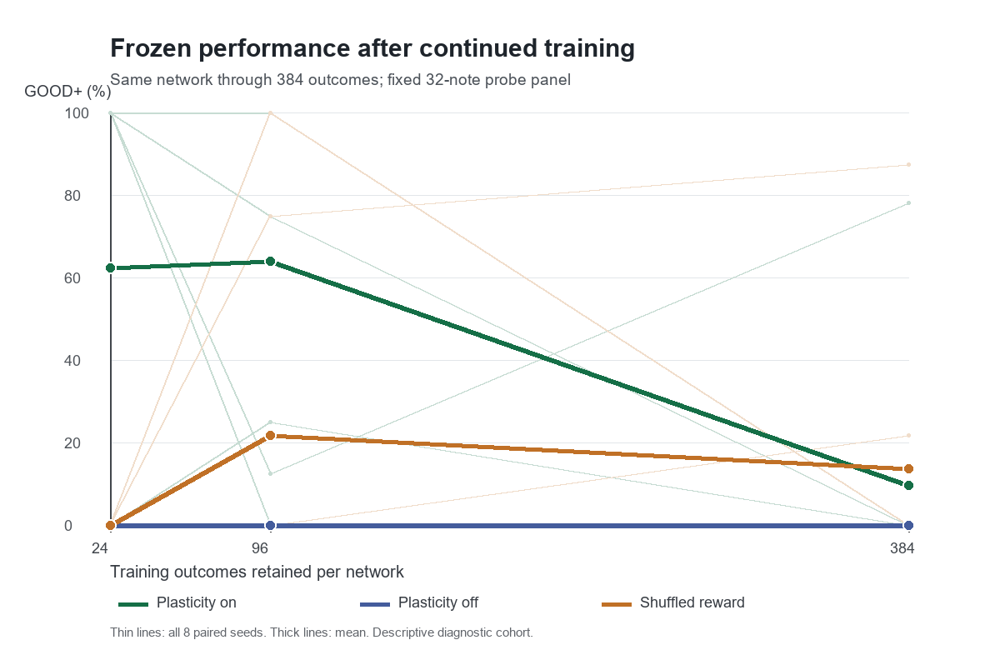

# Same-network longitudinal synthetic experiment

**Completed 2026-09-29.** The fixed 24/96/384-outcome protocol completed all eight selected seeds under plasticity on, plasticity off, and shuffled reward. Training stopped after seed 2007. The 47.61-minute run produced 9,216 training judgements and 2,304 frozen probe judgements. This is a diagnostic study of the artificial 128-neuron lane-one circuit, not fly-connectome evidence or a new M2 pass.

## Question and fixed protocol

The preceding study trained a separate network for only 24 outcomes. This experiment asks whether keeping the **same network state and weights** through 384 outcomes makes frozen behavior reliably improve beyond paired controls. `configs/long_continuation.json` was fixed before execution. It names seeds **2000–2007**, the first eight seeds of the already inspected held-out cohort; 2008–2031 were **not** run in this longer experiment. No outcome was used to choose a seed, checkpoint, model setting, or probe.

For each seed, all three conditions use its original 40 note times and cue gains as an exact prefix. Notes 41–384 extend that map using the predeclared independent RNG and the original uniform interval/gain choices. Neuron count (128), topology, plastic mask (480 edges), 1 ms tick, readout threshold (10), exploration probability (0.002), plasticity rate (0.2), weight bounds ([0, 2] mV), utility, reward baseline, and all other model settings are unchanged. The training horizon and necessary continuation of the note schedule are the only study changes. Every first-24 judgement, timing error, game and learning utility, RPE, and update count exactly reproduces its saved original run.

One training session per condition carries all coupled neural, readout, game, reward, RNG, eligibility, and weight state through 384 outcomes. At 24, 96 and 384 outcomes it is copied. Each copy receives the same independently generated **32-note relative-time/gain panel**, with a fresh game beginning at its checkpoint time; weights and exploration are frozen only in the copy. The training session continues untouched. No probe result enters a reward schedule or changes settings. The plasticity-off control keeps the matched initial network and map but disables updates. The shuffled control receives the on run's actual utility multiset in separately shuffled blocks 1–24, 25–96, and 97–384. Actual game utility and delivered learning utility are recorded separately.

## Frozen performance

GOOD+ means GOOD, GREAT or MAX among all 32 probe notes per run. All eight seeds are included.

| Training outcomes | Plasticity on | Plasticity off | Shuffled reward | On strictly beats off | On strictly beats shuffled |
| ---: | ---: | ---: | ---: | ---: | ---: |
| 24 | 62.50% | 0% | 0% | 5/8 | 5/8 |
| 96 | 64.06% | 0% | 21.88% | 7/8 | 6/8 |
| 384 | **9.77%** | 0% | **13.67%** | 1/8 | 1/8 (2 losses, 5 ties) |

The on mean drops **52.73 percentage points** from 24 to 384 outcomes, and the 384-outcome mean is **3.91 points below shuffled reward**. Thus retained weights and more practice do **not** establish reliable learning above controls in this cohort. At 384, only seed 2002's on network has any GOOD+ notes (25/32); shuffled wins in seeds 2001 and 2006. The frozen on condition has 123 MISS, 87 MEH, 21 OK and 25 GOOD judgements among 256 notes, with no GREAT or MAX. Its pooled absolute timing error among non-MISS hits is **103.4 ms**. By contrast, the last 288-note training block averages **55.69% GOOD+**, showing that training performance does not carry over to the exploration-free common panel.

| Seed | On at 24 / 96 / 384 (%) | Shuffled at 24 / 96 / 384 (%) | Off at all checkpoints |
| ---: | --- | --- | ---: |
| 2000 | 100 / 0 / 0 | 0 / 0 / 0 | 0 |
| 2001 | 100 / 100 / 0 | 0 / 75 / 87.5 | 0 |
| 2002 | 100 / 12.5 / 78.125 | 0 / 100 / 0 | 0 |
| 2003 | 100 / 75 / 0 | 0 / 0 / 0 | 0 |
| 2004 | 0 / 25 / 0 | 0 / 0 / 0 | 0 |
| 2005 | 0 / 100 / 0 | 0 / 0 / 0 | 0 |
| 2006 | 100 / 100 / 0 | 0 / 0 / 21.875 | 0 |
| 2007 | 0 / 100 / 0 | 0 / 0 / 0 | 0 |

## Update, action and baseline diagnostics

The table reports per-outcome averages within each training block for the on condition. Update norms sum absolute mV changes over all 480 plastic edges; they are **not** single-edge voltages. A clipped proposal count can count the same edge on many outcomes.

| Training block | Raw update L1 (mV/outcome) | Applied L1 (mV/outcome) | Upper / lower clipped edge proposals per outcome | Upper-bound edges at checkpoint (mean of 8) | Training null DOWNs per note | Mean absolute game utility prediction error |
| --- | ---: | ---: | ---: | ---: | ---: | ---: |
| 1–24 | 143.59 | 68.01 | 66.76 / 89.32 | 68.88 | 0.724 | 0.693 |
| 25–96 | 229.42 | 81.31 | 159.58 / 40.39 | 181.75 | 1.253 | 0.643 |
| 97–384 | 185.16 | 69.55 | 138.80 / 47.35 | 158.88 | 1.176 | 0.577 |

The upper clipping and raw/applied gap show that many proposed changes cannot be applied as written. They do not by themselves explain every loss: on seeds **2001, 2004, 2005 and 2007** have zero upper-bound edges at 384 and still score 0% GOOD+. Conversely, seed 2002 scores 78.125% with 289 upper-bound edges. Every 384-outcome on probe makes at least 32 DOWN actions. Failure is therefore not a simple absence of actions; the final on probes include 123 early attempted MISS judgements, and the non-MISS hits are predominantly low-tier/early. Null DOWNs are logged separately from actual osu judgements (mean 16 per 32-note on probe at 384).

The one global reward baseline is still imperfect: mean absolute **actual game utility minus predicted utility** on the on runs falls only from 0.693 to 0.577 across blocks. Mean signed residual changes from −0.102 to +0.052 to −0.009, so near-zero mean at the end does not mean low prediction error. Shuffled runs need two distinct quantities: actual game prediction error and delivered learning RPE. In block 97–384 their mean absolute values are **0.745 and 0.661**, respectively. Per-outcome values, update L1/L2/max, upper/lower clipping, bound occupancy, all DOWN dispositions, and both utility streams are in the event ledger.

## Interpretation and limits

The observed trajectory rejects **insufficient exposure alone** as a remedy for this fixed circuit and training rule. There are transient reward-aligned advantages at 24 and 96 outcomes, including seed 2005's 0→100% rise at 96, but they are not retained at 384. The combination of large clipped updates, high null/early presses, a fixed 200 ms motor cooldown, a context-free reward predictor and exploration-dependent training scores remains mechanistically suspect. This run distinguishes the long-horizon outcome from the short-horizon one; it does not isolate which of those mechanisms causes the collapse. The 32-note panel is common and disjoint from training, but it is one artificial panel, not a map-family generalization test. These eight previously inspected seeds are not an untouched sample, and this study does not replace the original 32-seed M2 reliability gate.

The off condition is a no-learning control, while shuffled reward changes the on-policy utility order offline within each block. Because behavior and actual utility can diverge after updates, shuffling controls temporal reward alignment under this specific yoking method; it does not prove a biologically correct RPE mechanism. No model parameter search, neural implementation change, fly data ingestion, or follow-on training was performed.

## Reproducibility and audit

- Protocol: `configs/long_continuation.json`.
- Runner: `scripts/long_continuation.py`; source and protocol SHA-256 manifests: `docs/figures/long_continuation/meta.json`.
- Complete per-outcome ledger: `docs/figures/long_continuation/runs.jsonl`; compact paired results: `result.json`; diagnostic aggregates: `diagnostics.json`; graph: `probe_good.png` in the same figure directory.
- `scripts/audit_long_continuation.py` passed: 24 unique rows; all 9,216 training and 2,304 probe outcomes present; original first-24 events reproduced; common probe panel; within-block shuffled multisets matched; frozen probe updates zero. The pre-run deterministic regression suite passed 80/80 tests. The final suite was rerun after this report.

**Seeds not tested longitudinally:** **2008–2031**, the remaining 24 seeds of the earlier 32-seed held-out cohort. Seeds 1000–1031 were development-only in the earlier threshold-selection study and also were not part of this continuation.
