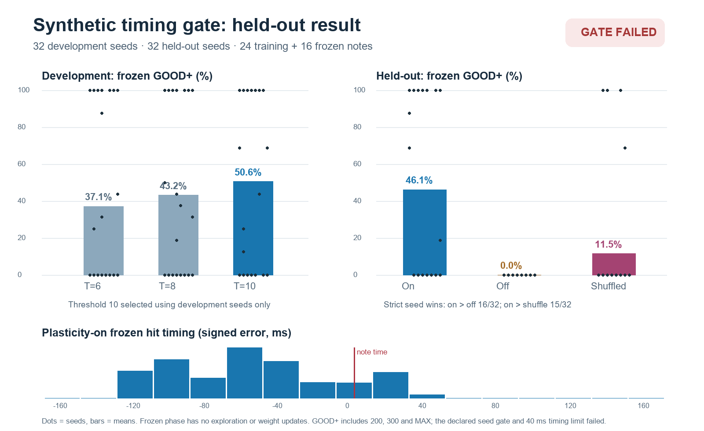

# Overnight synthetic learning study

**Outcome: completed; declared gate failed.** This is an engineered 128-neuron single-lane circuit experiment. It uses no fly connectome.

## Run integrity

The approved launcher started a local process at 02:11:57 Singapore time on 2026-09-29. The 192 planned trials finished at 02:42:49, after **30.87 minutes**, under the six-hour wall-time cap. The process exited and `stderr.log` is empty. The ledger has 192 unique keys: 96 development plasticity-on trials (32 seeds × three fixed motor thresholds) and 96 held-out trials (32 seeds × on/off/shuffled). All rows have the same predeclared configuration hash. Model-source hashes saved at launch still match the source files.

The [predeclared configuration](../configs/overnight_synthetic.json) used 24 training notes and 16 frozen notes per trial. Each seed had a deterministic, distinct slow one-lane map with 800–1200 ms intervals and per-note cue gain drawn from a declared set. Within each held-out seed, all three conditions used identical note times and cue gains. All 32 shuffled controls received a permutation of the on-condition training utility multiset; every permutation changed order. Frozen events logged **zero weight updates**. The [raw ledger](figures/overnight_synthetic/runs.jsonl), [selection record](figures/overnight_synthetic/selection.json), [result](figures/overnight_synthetic/result.json), [status](figures/overnight_synthetic/status.json), and [source manifest](figures/overnight_synthetic/meta.json) are retained.

## Measured result

Development selection used **only** plasticity-on frozen GOOD 200-or-better rate. Mean rates at motor thresholds 6, 8 and 10 were **37.1%, 43.2%, 50.6%** respectively. The declared rule selected threshold **10**; held-out outcomes were not used for this selection.

| Held-out frozen metric, 32 seeds × 16 notes | On | Off | Shuffled reward |
| --- | ---: | ---: | ---: |
| GOOD 200 or better | **46.1%** | 0% | 11.5% |
| Any non-MISS | 72.1% | 0% | 25.0% |
| Mean hit value, out of 320 | 137.8 | 0 | 35.9 |

On-condition frozen judgements across 512 notes were **58 MAX, 64 GREAT 300, 114 GOOD 200, 67 OK 100, 66 MEH 50 and 143 MISS**. This is a substantial precision gain over the earlier eight-note fixture, which produced no MAX judgements, but performance remains uneven across seeds.

The predeclared gate required ≥20 mean paired percentage points and **strict wins in ≥24/32 seeds** against **each** control; it also required on-condition GOOD+ ≥30% and mean absolute hit error ≤40 ms. Mean paired advantages passed at **46.1 points versus off** and **34.6 points versus shuffled**. Strict wins were only **16/32 versus off** and **15/32 versus shuffled** (three strict losses to shuffled). The on-condition mean absolute error among non-MISS hits was **60.6 ms**. **Both seed-consistency requirements and the timing requirement failed.**

Of the 369 on-condition non-MISS frozen hits, **305 were early, 56 late and eight exactly on time**; mean signed error was **−56.1 ms**. Every one of the 143 frozen MISS records contains an early attempted press. Sixteen of 32 seeds scored no GOOD-or-better frozen notes; six of those scored no frozen hits at all. The high mean therefore does not establish a reliable policy.

## Interpretation and next gate

The data support a plasticity-dependent average improvement on this declared slow synthetic map family. They do not pass M2's reliable, precise learning gate, establish transfer to dense maps, or validate a fly circuit. Random spacing and cue gain are limited perturbations; they do not exercise simultaneous lanes, visual processing, or high BPM.

Before another long training run, add selective traces of cue phase, relay/motor spikes, threshold crossings and null presses around each early action. Use those to diagnose why some seeds press before the early MISS boundary, then predeclare a revised readout/credit hypothesis and evaluate it on fresh held-out seeds with the same controls. The present ledger does not save complete final weight distributions or saturation counts, so those diagnostics also need adding before a weight-bound claim. Fly-data ingestion remains a separate, unstarted stage; its [candidate source and route](BIOLOGY.md) still require source-ID and pathway audit.
